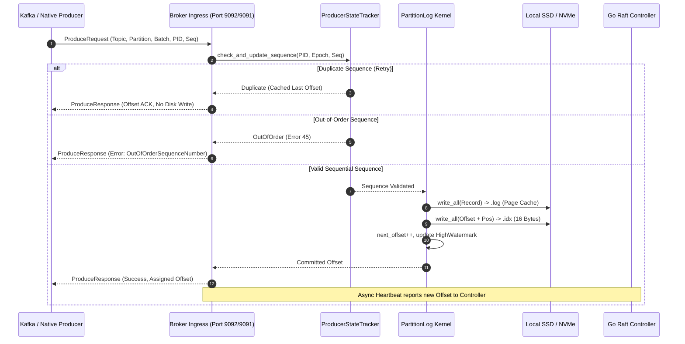
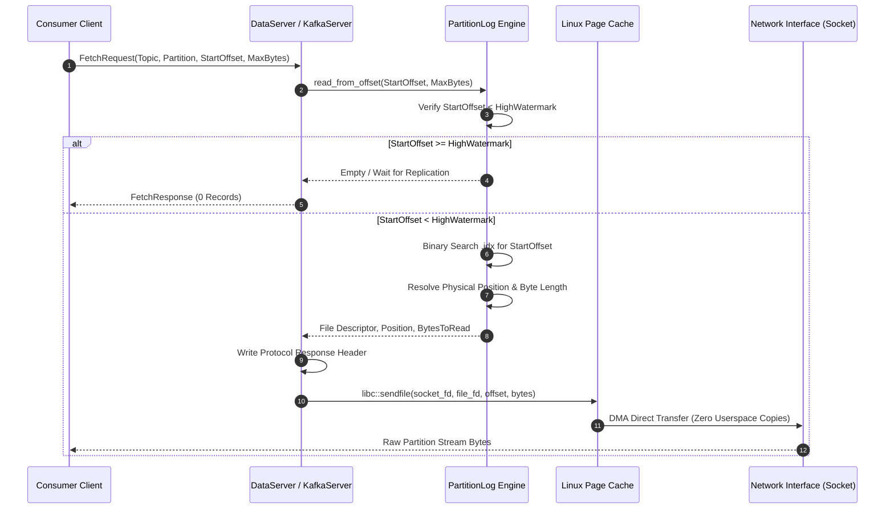
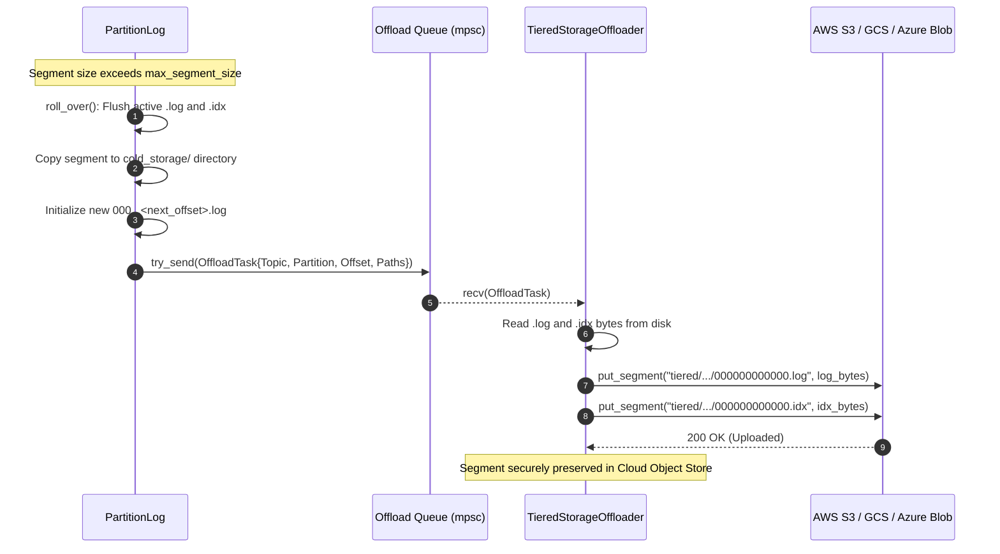

# AeroStream: System Architecture & Engineering Deep-Dive

**AeroStream** is a distributed, high-throughput, cloud-native event streaming and messaging engine designed for microsecond-latency event distribution, petabyte-scale retention, and modern cloud deployment. AeroStream addresses fundamental architectural bottlenecks in traditional distributed streaming platforms (such as JVM memory churn, stop-the-world garbage collection pauses, heavy thread thrashing, and fragile external consensus dependencies) by implementing a **Dual-Engine Architecture**:

1. A distributed, resilient **Control Plane** authored in **Go**, utilizing HashiCorp Raft for cluster state consensus, metadata quorum, schema governance, RBAC enforcement, connectors management, and stream transforms.
2. An extreme-performance, zero-copy **Data Plane** authored in **Rust**, utilizing Tokio with CPU-pinned worker threads, kernel `sendfile(2)` zero-copy transfers, memory-mapped (`mmap`) indices, append-only segmented commit logs, Kafka wire-protocol compatibility, and multi-cloud tiered storage offloading.

---

## 1. Executive Architectural Overview & Dual-Engine Rationale

Traditional event streaming architectures often compromise between runtime simplicity, developer velocity, operational stability, and hardware utilization. Systems implemented entirely on the Java Virtual Machine require hundreds of megabytes or gigabytes of heap memory, extensive garbage collection tuning, and hundreds of threads even under minimal workload. Systems implemented entirely in lower-level C++ or Rust often struggle with the complexity of maintaining stateful control plane services, dynamic REST endpoints, schema registries, and third-party connector ecosystems.

AeroStream resolves this dichotomy through clean physical and architectural decoupling:


```
+===================================================================================================+
|                                    AeroStream Dual-Engine Topology                                |
+===================================================================================================+
|                                                                                                   |
|  [ Kafka Clients ]      [ Native TCP Clients ]     [ Web Console UI ]     [ HTTP REST / Curl ]     |
|   (:9092 wire)               (:9091 data)             (:9001 Angular)          (:9001 REST)       |
|         │                          │                         │                       │            |
|         │                          │                         └───────────┬───────────┘            |
|         │                          │                                     │                        |
|         ▼                          ▼                                     ▼                        |
|  +───────────────────────────────────────────────+      +──────────────────────────────────────+  |
|  |           RUST STORAGE DATA PLANE             |      |        GO RAFT CONTROL PLANE         |  |
|  |       (Storage Broker Kernel - Port 9091/9092)|      |      (Cluster Controller - Port 8001)|  |
|  +───────────────────────────────────────────────+      +──────────────────────────────────────+  |
|  | * Tokio Async I/O (epoll / kqueue)            |      | * HashiCorp Raft Consensus Quorum    |  |
|  | * Pinned CPU Threads (libc::sched_setaffinity)|      | * Topic & Partition Metadata FSM     |  |
|  | * Zero-Copy Network Transfer (sendfile(2))    |      | * Confluent Schema Registry          |  |
|  | * Append-Only Commit Log (.log / .idx)        |◄────►| * Granular RBAC & ACL Policy Engine  |  |
|  | * CRC32 (IEEE 802.3) & CRC32C (Castagnoli)    | gRPC | * Cooperative Sticky Rebalance       |  |
|  | * Idempotent Producer Tracking (EOS)          |      | * Stream Transforms (WASM/Filter/PII)|  |
|  | * Background Log Compaction & Tombstone GC   |      | * Kafka Connect Management API       |  |
|  | * Async Tiered Storage Offloader Pipeline     |      | * Broker Heartbeats & Drain Workflow |  |
|  +───────────────────────┬───────────────────────+      +──────────────────────────────────────+  |
|                          │                                                                        |
|                          ▼                                                                        |
|  +─────────────────────────────────────────────────────────────────────────────────────────────+  |
|  |                                Multi-Cloud Tiered Storage                                   |  |
|  |      [ NVMe / SSD Hot ] ──► [ AWS S3 / MinIO ] ──► [ Google Cloud GCS ] ──► [ Azure Blob ]  |  |
|  +─────────────────────────────────────────────────────────────────────────────────────────────+  |
+===================================================================================================+
```

### Why Go for the Control Plane?

1. **Rich Distributed Systems Ecosystem**: The Go ecosystem is the gold standard for consensus protocols, metadata coordination, and cloud-native integration (HashiCorp Raft, etcd/Raft, Kubernetes client libraries, gRPC-Go).
2. **Rapid Extensibility & Memory Safety**: The control plane requires comprehensive JSON/REST APIs, Confluent-compatible Schema Registry endpoints, role-based authorization rules, dynamic stream transformations, and Kafka Connect management. Go provides high concurrency with lightweight goroutines without the manual memory management or compile-time lifetime mechanics that would slow down iteration in Rust.
3. **Deterministic Memory Footprint for Quorum**: Control plane metadata state resides strictly in structured memory maps (topics, partitions, consumer group generations, ACLs), replicated via Raft logs and periodically snapshotted to disk.

### Why Rust for the Data Plane?

1. **Predictable Latency & Zero Garbage Collection**: The commit log storage engine, socket read/write loops, and segment rollover pipelines must never suffer from garbage collection pauses. Rust's compile-time ownership model guarantees zero GC stalls.
2. **Zero-Copy Kernel Socket Transfers**: For fetch operations, AeroStream invokes Linux [`sendfile(2)`](file:///home/uttam/projects/AeroMQ/rust-broker/src/net/server.rs#L135), transferring log segment pages directly from the Linux Page Cache to the network socket descriptor without transitioning through userspace memory buffers.
3. **Strict Memory Mapping & Cache Management**: Index lookups leverage fixed-size 16-byte entries (`[offset: 8 bytes BE][position: 8 bytes BE]`), allowing sub-microsecond binary searches over memory-mapped files without heap allocations.
4. **Hardware Affinity**: Tokio worker threads are pinned to isolated CPU cores using [`libc::sched_setaffinity`](file:///home/uttam/projects/AeroMQ/rust-broker/src/main.rs#L144), eliminating thread context switching and cache bouncing.

### Measured results

Tested under strict container constraints (`--cpus=2.0 --memory=2g`), single node, median of 3 runs, host networking, image `quay.io/gradientgeeks/aerostream:latest`.
Full methodology, per-run ranges and durability caveats are in [`benchmarks/BENCHMARK.md`](../../benchmarks/BENCHMARK.md).

| Metric | AeroStream (native port) | AeroStream (Kafka port) |
| :--- | ---: | ---: |
| **100 B messages (msgs/s)** | **186,727** | **188,324** |
| **1 KB messages (msgs/s)** | **174,714** | 71,023 |
| **1 MB messages (MB/s)** | 347 (277-1,233) | 333 |
| **10 MB messages (MB/s)** | 276 (271-914) | 166 |
| **50 MB messages (MB/s)** | **280** | 81 |
| **Broker idle memory** | **1.3-5.4 MiB** | 1.3 MiB |
| **Peak memory under load** | 320 MiB | 143 MiB |
| **OS threads** | 3 | 3 |
| **Time until usable** | 1.8-3.4 s | 1.8-3.4 s |

--- | ---: | ---: | ---: | ---: |
| **100 B messages (msgs/s)** | 146,199 | 178,253 | **186,727** | **188,324** |
| **1 KB messages (msgs/s)** | 46,729 | 67,385 | **174,714** | 71,023 |
| **1 MB messages (MB/s)** | **384** | 306 | 347 (277-1,233) | 333 |
| **10 MB messages (MB/s)** | 240 | **299** | 276 (271-914) | 166 |
| **50 MB messages (MB/s)** | 81 | 95 | **280** | 81 |
| **Broker idle memory** | 314 MiB | 137 MiB | **1.3-5.4 MiB** | 1.3 MiB |
| **Peak memory under load** | 1,434 MiB | 1,364 MiB | 320 MiB | 143 MiB |
| **OS threads** | 130 | 10 | 3 | 3 |
| **Time until usable** | 3.9-4.2 s | **0.75 s** | 1.8-3.4 s | 1.8-3.4 s |

---

## 2. Control Plane Deep-Dive (`go-controller/`)

The AeroStream Control Plane runs as the central coordination daemon (`controller`). It manages cluster membership, topic partitions, leader assignments, high-watermark computation, schema governance, stream transformations, connectors, and role-based access control.

```
+─────────────────────────────────────────────────────────────────────────────────────────────+
|                                Go Controller Internal Architecture                          |
+─────────────────────────────────────────────────────────────────────────────────────────────+
|                                                                                             |
|        [ REST API :9001 ]       [ gRPC ControlService :8001 ]    [ Raft Consensus :7001 ]   |
|                 │                              │                               │            |
|                 ▼                              ▼                               ▼            |
|       +───────────────────+          +───────────────────+           +───────────────────+  |
|       |    REST Server    |          |    gRPC Server    |           |     RaftNode      |  |
|       |  (api.go / HTTP)  |          | (server.go / gRPC)|           |  (raft.go / TCP)  |  |
|       +─────────┬─────────+          +─────────┬─────────+           +─────────┬─────────+  |
|                 │                              │                               │            |
|                 ├──────────────────────────────┴───────────────────────────────┤            |
|                 ▼                                                              ▼            |
|       +──────────────────────────────────+           +───────────────────────────────────+  |
|       |      State Subsystems & Logic    |           |    HashiCorp Raft Consensus Core  |  |
|       |                                  |           |                                   |  |
|       | * Schema Registry (registry.go)  |           | * FSM State Machine (fsm.go)      |  |
|       | * Transform Engine (engine.go)   |◄─────────►| * ClusterState State Container    |  |
|       | * ACL / RBAC Manager (acls.go)   |  Propose  | * Snapshot & Restore Engine       |  |
|       | * Connect Manager (manager.go)   |  Log Entry| * Failure Detection & Drain Logic |  |
|       +──────────────────────────────────+           +───────────────────────────────────+  |
+─────────────────────────────────────────────────────────────────────────────────────────────+
```

### 2.1 Raft Consensus Engine

The consensus core is implemented in [`RaftNode`](file:///home/uttam/projects/AeroMQ/go-controller/pkg/consensus/raft.go#L14) using the HashiCorp Raft implementation.

1. **Node Initialization & Transport**:
   * [`NewRaftNode`](file:///home/uttam/projects/AeroMQ/go-controller/pkg/consensus/raft.go#L20) parses [`ControllerConfig`](file:///home/uttam/projects/AeroMQ/go-controller/pkg/config/config.go).
   * Configures heartbeat timeouts, election timeouts (1000ms default), leader lease timeouts (500ms), and commit timeouts (50ms).
   * Binds a dedicated TCP transport on port `7001` using `raft.NewTCPTransport`.
2. **Log, Stable, and Snapshot Storage**:
   * In-memory or file-backed stable storage is allocated alongside a [`raft.FileSnapshotStore`](file:///home/uttam/projects/AeroMQ/go-controller/pkg/consensus/raft.go#L63) keeping the 2 most recent snapshots on disk under `cfg.DataDir`.
   * When `bootstrap = true`, the initial node bootstraps the single-voter cluster configuration. Subsequent nodes execute [`RaftNode.Join`](file:///home/uttam/projects/AeroMQ/go-controller/pkg/consensus/raft.go#L155) to be admitted as voters via `AddVoter`.
3. **Finite State Machine ([`FSM`](file:///home/uttam/projects/AeroMQ/go-controller/pkg/consensus/fsm.go#L78))**:
   * Implements `raft.FSM` with [`Apply`](file:///home/uttam/projects/AeroMQ/go-controller/pkg/consensus/fsm.go#L129), [`Snapshot`](file:///home/uttam/projects/AeroMQ/go-controller/pkg/consensus/fsm.go#L841), and [`Restore`](file:///home/uttam/projects/AeroMQ/go-controller/pkg/consensus/fsm.go#L854).
   * Operates over a unified state container [`ClusterState`](file:///home/uttam/projects/AeroMQ/go-controller/pkg/consensus/fsm.go#L70):
     ```go
     type ClusterState struct {
         Brokers        map[uint32]*BrokerStatus        `json:"brokers"`
         Topics         map[string]*TopicState          `json:"topics"`
         ConsumerGroups map[string]*ConsumerGroupState  `json:"consumer_groups"`
         Offsets        map[string]int64                `json:"offsets"`
     }
     ```
   * State modifications are submitted through [`RaftNode.Propose(op, payload)`](file:///home/uttam/projects/AeroMQ/go-controller/pkg/consensus/raft.go#L97). If the local node is not the leader, `Propose` fails immediately and redirects the caller to the active leader address returned by `Raft.Leader()`.

### 2.2 Topic & Partition Metadata State Machine

The FSM processes discrete state transition commands:

* **`CmdRegisterBroker`**: Adds or reactivates a broker record ([`BrokerStatus`](file:///home/uttam/projects/AeroMQ/go-controller/pkg/consensus/fsm.go#L21)), setting `Active: true` and updating `LastSeen`.
* **`CmdCreateTopic`**: Distributes partition replicas deterministically across active brokers using round-robin distribution:
  ```go
  leaderID = activeBrokers[int(i)%len(activeBrokers)]
  for r := uint32(0); r < payload.ReplicationFactor && r < uint32(len(activeBrokers)); r++ {
      replicaIdx := (int(i) + int(r)) % len(activeBrokers)
      replicas = append(replicas, activeBrokers[replicaIdx])
  }
  ```
* **`CmdBrokerHeartbeat`**: Updates replica log end offsets reported by storage brokers.
* **In-Sync Replicas (ISR) & High-Watermark (HW) Evaluation**:
  [`updateISRAndHW()`](file:///home/uttam/projects/AeroMQ/go-controller/pkg/consensus/fsm.go#L404) re-evaluates all partitions:
  1. The leader is included in the ISR if it is active and its heartbeat is within `brokerInactiveTimeout` (default 6 seconds).
  2. Follower replicas are validated: if `(leaderOffset - followerOffset) <= replicaLagTolerance` (default 1000 offsets), the follower is retained in `ISR`.
  3. The **High-Watermark** is strictly computed as the minimum offset among all replicas currently in the ISR:
     $$\text{HighWatermark} = \min_{r \in \text{ISR}} (\text{ReplicaOffsets}[r])$$
     Consumers are never permitted to read past the High-Watermark.

### 2.3 Cooperative Sticky Consumer Group Rebalance Protocol

AeroStream implements a non-blocking cooperative sticky rebalance protocol ([`rebalanceGroup`](file:///home/uttam/projects/AeroMQ/go-controller/pkg/consensus/fsm.go#L497)), modeled after Kafka's KIP-848:

1. **State Preservation**: When members join or leave, active members retain their currently assigned partitions (`g.Assignments[mID]`).
2. **Quota Calculation**: For each topic, partitions ($N$) and subscribed members ($M$) define the baseline quota $\lfloor N/M \rfloor$ and remainder $N \pmod M$.
3. **Cooperative Shedding**:
   * Members holding more than their allowed max quota shed excess partitions into `m.RevokingPartitions`.
   * Partitions not held by any member (or orphaned from departing members) are gathered into `unassigned`.
4. **Least-Loaded Migration**: Unassigned partitions are allocated exclusively to the least-loaded subscribed members, minimizing partition movement and eliminating stop-the-world consumer stalls.

### 2.4 Built-In Confluent-Compatible Schema Registry

Implemented in [`schemaregistry.Registry`](file:///home/uttam/projects/AeroMQ/go-controller/pkg/schemaregistry/registry.go#L105), AeroStream provides a drop-in replacement for the Confluent Schema Registry on `/subjects`, `/schemas`, and `/compatibility`:

* **Supported Formats**:
  * **Avro**: Validated as strict JSON; fields parsed for types, defaults, and promotions.
  * **JSON Schema**: Draft-07 compatible property parsing with `required` and `default` validation.
  * **Protobuf**: Proto3 specification parsing extracting field tags and types.
* **Global Deduplication & Versioning**:
  * When a schema is registered via [`RegisterSchema`](file:///home/uttam/projects/AeroMQ/go-controller/pkg/schemaregistry/registry.go#L126), AeroStream computes a canonical hash `type:canonicalStr`. If already present globally, the existing `id` is reused; otherwise, `GlobalIDCounter` is incremented.
  * Per-subject versions increment sequentially (`1, 2, 3...`).
* **Compatibility Rules Engine ([`compatibility.go`](file:///home/uttam/projects/AeroMQ/go-controller/pkg/schemaregistry/compatibility.go#L13))**:
  * `BACKWARD` (Default): New schema can read data written with old schema. Added fields must have default values; deleted fields are permitted.
  * `FORWARD`: Old schema can read data written with new schema. Deleted fields must have had default values in the old schema; added fields are permitted.
  * `FULL`: Enforces both `BACKWARD` and `FORWARD` compatibility simultaneously.
  * `NONE`: Compatibility validation disabled.
  * **Avro Type Promotion**: Supports automatic numeric promotions: `int` $\rightarrow$ `long` $\rightarrow$ `float` $\rightarrow$ `double`, and `string` $\leftrightarrow$ `bytes`.

### 2.5 In-Broker Stream Transforms Engine

The stream transform engine ([`transform.Engine`](file:///home/uttam/projects/AeroMQ/go-controller/pkg/transform/engine.go#L52)) executes real-time data transformations directly on record streams between a `source_topic` and a `target_topic`:

```
Incoming Record ──► [ Transform Engine ] ──┬──► (Match/Pass) ──► Target Topic
                                           └──► (Drop/Mask)  ──► Dropped / Sanitized
```

* **Transform Types**:
  1. [`TypeMaskPII`](file:///home/uttam/projects/AeroMQ/go-controller/pkg/transform/engine.go#L20): Recursively traverses JSON objects and masks sensitive keys (e.g. `credit_card`, `ssn`, `password`, `email`, `cvv`, `auth_token`) with configurable patterns (e.g. `***`).
  2. [`TypeFilter`](file:///home/uttam/projects/AeroMQ/go-controller/pkg/transform/engine.go#L19): Evaluates boolean and numeric expressions over JSON payloads (`==`, `!=`, `>`, `<`, `>=`, `<=`, `contains`). Records failing the condition are discarded without allocation.
  3. [`TypeJSONMap`](file:///home/uttam/projects/AeroMQ/go-controller/pkg/transform/engine.go#L21): Real-time field manipulation supporting `add_fields`, `rename_fields`, `remove_fields`, and `set_*` operators, stamping `_transformed_at` and `_engine: aerostream-inline`.
  4. [`TypeWASM`](file:///home/uttam/projects/AeroMQ/go-controller/pkg/transform/engine.go#L18): Runs WebAssembly WASI binaries sandboxed in the broker pipeline, measuring gas usage and execution microseconds (`wazero` compatible runtime).

### 2.6 Role-Based Access Control & Granular ACLs

Enterprise security is enforced by [`auth.AclManager`](file:///home/uttam/projects/AeroMQ/go-controller/pkg/auth/acls.go#L66):

* **Standard Roles**: `SUPER_ADMIN`, `OPERATOR`, `PRODUCER`, `CONSUMER`, `AUDITOR`.
* **Zero-Trust Default Deny**: Every resource request is rejected unless an explicit `ALLOW` rule or `SUPER_ADMIN` identity is established.
* **Explicit Precedence**:
  1. **Explicit DENY**: An explicit `DENY` rule overrides all other rules, including `SUPER_ADMIN`.
  2. **SUPER_ADMIN**: Grants unrestricted cluster, topic, and consumer group privileges.
  3. **Explicit ALLOW**: Granted if rule criteria match.
  4. **Zero-Trust Fallback**: Rejected.
* **Wildcard & Pattern Matching**:
  * Principal match: Exact (`User:alice`), wildcard (`User:*` or `*`), or glob (`service-*`).
  * Resource match: Exact (`orders`), prefix (`orders-*`), or universal wildcard (`*`).
  * Operation match: `READ`, `WRITE`, `DESCRIBE`, `ALTER`, or `ALL`.

### 2.7 Connectors Ecosystem & Worker Task Model

AeroStream provides a Confluent Kafka Connect REST-compatible connector subsystem ([`connect.ConnectorManager`](file:///home/uttam/projects/AeroMQ/go-controller/pkg/connect/manager.go#L53)):

* **REST API Endpoints**: `/api/connectors`, `/connectors`, `/connector-plugins`, `/api/connectors/{name}/pause`, `/api/connectors/{name}/resume`.
* **Built-in Connector Plugins**:
  * `S3ArchivalSinkConnector`: Archives real-time partition records into AWS S3/MinIO bucket hierarchies.
  * `HttpWebhookSinkConnector`: Dispatches records to external HTTP REST endpoints with configurable retry policies.
  * `DatabaseCdcSourceConnector`: Ingests simulated Change Data Capture (CDC) events from relational databases.
  * `ElasticSearchSinkConnector`: Streams structured JSON records to OpenSearch/Elasticsearch indexes.

### 2.8 Controller-Broker Control Plane Orchestration & Lifecycle

The orchestration between the Go Control Plane and the Rust Data Plane is driven by high-performance gRPC over HTTP/2, defined in [`proto/control.proto`](file:///home/uttam/projects/AeroMQ/proto/control.proto):


```
+===================================================================================================+
|                        AeroStream Controller-Broker Control Plane Channels                        |
+===================================================================================================+
|                                                                                                   |
|    +─────────────────────────────────+             +────────────────────────────────────────+     |
|    |      GO CONTROLLER (LEADER)     |             |         RUST STORAGE BROKER            |     |
|    |  Raft Consensus & State Machine |             |       Data Plane Storage Kernel        |     |
|    +────────────────┬────────────────+             +───────────────────┬────────────────────+     |
|                     │                                                  │                          |
|                     │◄─── 1. RegisterBroker(host, ports, rack) ────────┤ (At broker startup)      |
|                     ├─── RegisterBrokerResponse(success) ─────────────►│                          |
|                     │                                                  │                          |
|                     │◄─── 2. Heartbeat(disk_usage, replica_offsets) ───┤ (Every 2 seconds)        |
|                     │     [Log End Offsets (LEO) reported per partition]│                         |
|                     │                                                  │                          |
|                     ├─── 3. HeartbeatResponse ────────────────────────►│ (Piggybacked state)      |
|                     │     - assigned_leaders & assigned_followers      │                          |
|                     │     - client_quotas (producer/consumer byte rates)                          |
|                     │     - topic_compression (zstd/lz4/snappy codecs)  │                         |
|                     │                                                  │                          |
|                     │                                                  │                          |
|    +────────────────┴────────────────+             +───────────────────┴────────────────────+     |
|    |     FAILURE DETECTION & DRAIN   |             |       REPLICA REPLICATION (CMD 3)      |     |
|    +─────────────────────────────────+             +────────────────────────────────────────+     |
|    | * Sweep every 3s: timeout > 8s  |             | * Follower broker issues Native Cmd 3  |     |
|    | * Reassign leaders from ISR     |◄── gRPC ───►| * Leader updates follower offset       |     |
|    | * POST /api/brokers/{id}/drain  |             | * Advances partition High Watermark    |     |
|    +─────────────────────────────────+             +────────────────────────────────────────+     |
+===================================================================================================+
```

1. **Broker Registration**:
   Upon startup, each Rust broker calls [`ControlService.RegisterBroker`](file:///home/uttam/projects/AeroMQ/go-controller/pkg/grpcserver/server.go#L62) carrying `broker_id`, `host`, `data_port` (`9091`), `kafka_port` (`9093`), and `rack` identifier. The controller commits a `CmdRegisterBroker` entry into the Raft log, recording the broker in [`ClusterState.Brokers`](file:///home/uttam/projects/AeroMQ/go-controller/pkg/consensus/fsm.go#L71).

2. **Bidirectional 2-Second Heartbeat & LEO Reporting**:
   Every 2 seconds, each broker invokes [`ControlService.Heartbeat`](file:///home/uttam/projects/AeroMQ/go-controller/pkg/grpcserver/server.go#L88):
   * **Payload**: Carries `disk_usage_bytes`, `disk_free_bytes`, and `repeated ReplicaOffset replica_offsets` ($[\text{topic}, \text{partition}, \text{offset}]$). Each offset represents the local broker's Log End Offset (LEO) for partitions it replicates.
   * **Piggybacked Dynamic Configuration Push**: The controller's `HeartbeatResponse` carries cluster partition assignments (`assigned_leaders`, `assigned_followers`), and piggybacks live dynamic configurations without requiring separate polling loops:
     * `client_quotas`: Dynamic producer byte rates, consumer byte rates, and request percentage quotas.
     * `topic_compression`: Live per-topic forced compression codecs (`zstd`, `lz4`, `snappy`, `gzip`, `uncompressed`).

3. **In-Sync Replicas (ISR) & High-Watermark Dynamics**:
   The controller evaluates replica health via [`updateISRAndHW`](file:///home/uttam/projects/AeroMQ/go-controller/pkg/consensus/fsm.go#L404):
   * A replica is retained in the ISR if $(\text{leader\_LEO} - \text{follower\_LEO}) \le \text{replicaLagTolerance}$ (default 10 offsets).
   * If a follower lags beyond this tolerance, the controller evicts it from the ISR and broadcasts updated metadata.
   * The **High-Watermark (HW)** is computed as the minimum offset across all in-sync replicas:
     $$\text{HighWatermark} = \min_{r \in \text{ISR}} (\text{LEO}_r)$$
   * Consumers can only read up to the High-Watermark, guaranteeing that committed messages survive broker failovers.

4. **Failure Detection & Automatic Partition Failover (8s Timeout)**:
   [`Server.startFailureDetection`](file:///home/uttam/projects/AeroMQ/go-controller/pkg/grpcserver/server.go#L37) sweeps registered brokers every 3 seconds. If any broker fails to heartbeat within `broker_inactive_timeout_ms` (default 8,000 ms), the controller immediately:
   * Proposes `CmdCleanInactive` through Raft consensus.
   * Marks the unresponsive broker `Active = false`.
   * Reassigns leadership of all orphaned partitions to the most caught-up replica currently in the ISR in under 100ms.

5. **Graceful Broker Draining Workflow**:
   Before performing maintenance or decommissioning a node, operators issue `POST /api/brokers/{id}/drain`. The controller proposes [`CmdDrainBroker`](file:///home/uttam/projects/AeroMQ/go-controller/pkg/consensus/fsm.go#L183):
   * Reassigns all partition leadership away from the draining broker to surviving ISR members.
   * Substitutes the draining broker in `ReplicaIDs` with healthy active brokers.
   * Cleanses the broker from all ISRs, enabling safe node retirement without client-facing errors or partition unavailability.

6. **Native Command 3 Follower Replication**:
   Follower storage brokers replicate partition data from leaders using native TCP Command 3 (Replica Fetch). The leader reads data past the High-Watermark (up to its active LEO), updates the follower's replica offset via [`update_follower_offset`](file:///home/uttam/projects/AeroMQ/rust-broker/src/log/manager.rs#L540), and streams records via zero-copy `sendfile(2)`. As follower offsets advance, the leader recalculates its local High-Watermark and notifies waiting consumer fetch loops.

---

## 3. Data Plane Deep-Dive (`rust-broker/`)

The AeroStream Data Plane runs as the native storage daemon (`rust-broker`). It is engineered in pure Rust for non-blocking asynchronous I/O, physical log layout optimization, and kernel-level zero-copy data pipelines.


```
+===================================================================================================+
|                             AeroStream Shard-per-Core Data Plane Architecture                     |
+===================================================================================================+
|                                                                                                   |
|  [ Kafka Clients (:9093) ]                              [ Native TCP Clients (:9091) ]            |
|               │                                                        │                          |
|               ▼                                                        ▼                          |
|  +─────────────────────────────────────────────────────────────────────────────────────────────+  |
|  |                     Tokio Asynchronous Network Ingress & ShardRouter                        |  |
|  |           shard_id = (DefaultHasher(topic, partition)) % num_shards                         |  |
|  +─────────────────────────────────────────────────────────────────────────────────────────────+  |
|            │                                 │                                 │                  |
|            ▼ (flume channel)                 ▼ (flume channel)                 ▼ (flume channel)  |
|  +───────────────────────────+ +───────────────────────────+ +───────────────────────────+        |
|  |      SHARD ENGINE #0      | |      SHARD ENGINE #1      | |      SHARD ENGINE #2..N   |        |
|  | Dedicated OS Thread       | | Dedicated OS Thread       | | Dedicated OS Thread       |        |
|  | Pinned to CPU Core 0      | | Pinned to CPU Core 1      | | Pinned to CPU Core 2..N   |        |
|  | (libc::sched_setaffinity) | | (libc::sched_setaffinity) | | (libc::sched_setaffinity) |        |
|  +───────────────────────────+ +───────────────────────────+ +───────────────────────────+        |
|  | * Owned PartitionLogs     | | * Owned PartitionLogs     | | * Owned PartitionLogs     |        |
|  | * In-Place Offset Patch   | | * In-Place Offset Patch   | | * In-Place Offset Patch   |        |
|  | * Paced Writeback (8 MiB) | | * Paced Writeback (8 MiB) | | * Paced Writeback (8 MiB) |        |
|  | * Out-of-Lock Disk Reads  | | * Out-of-Lock Disk Reads  | | * Out-of-Lock Disk Reads  |        |
|  | * Hard-Linked Archival    | | * Hard-Linked Archival    | | * Hard-Linked Archival    |        |
|  +─────────────┬─────────────+ +─────────────┬─────────────+ +─────────────┬─────────────+        |
|                │                             │                             │                      |
|                ▼                             ▼                             ▼                      |
|  +─────────────────────────────────────────────────────────────────────────────────────────────+  |
|  |                                Physical NVMe Storage & Tiered Offload                       |  |
|  |   [ .log / .idx Files ] ──► [ cold_storage/ (Hard Links) ] ──► [ AWS S3 / GCS / Azure Blob ]|  |
|  +─────────────────────────────────────────────────────────────────────────────────────────────+  |
+===================================================================================================+
```

### 3.1 Shard-per-Core Architecture & Thread-per-Core Engine

Traditional multi-threaded streaming brokers protect partition commit logs with coarse read-write locks or mutexes across thread pools. Under high core counts, this model suffers from CPU cache-line bouncing, memory bus contention, and lock serialization stalls.

AeroStream eliminates these bottlenecks by implementing a **Shard-per-Core (Thread-per-Core)** execution model ([`rust-broker/src/shard/`](file:///home/uttam/projects/AeroMQ/rust-broker/src/shard/)):

1. **Hardware Core Pinning (`libc::sched_setaffinity`)**:
   In [`spawn_shards`](file:///home/uttam/projects/AeroMQ/rust-broker/src/shard/engine.rs#L305), the broker detects available CPU cores (`std::thread::available_parallelism()`) and spawns dedicated OS threads named `shard-0`, `shard-1`, ..., `shard-N`. Each thread is explicitly pinned to its designated core:
   ```rust
   let mut cpuset: libc::cpu_set_t = std::mem::zeroed();
   libc::CPU_SET(shard_id % num_cpus, &mut cpuset);
   libc::sched_setaffinity(0, std::mem::size_of::<libc::cpu_set_t>(), &cpuset);
   ```
   This isolates shard execution to specific CPU execution units, guaranteeing maximum L1/L2 data and instruction cache locality while preventing Linux thread scheduler migration penalties.

2. **Deterministic Partition Routing (`ShardRouter`)**:
   Network ingress handlers in Tokio route incoming requests using the deterministic [`ShardRouter`](file:///home/uttam/projects/AeroMQ/rust-broker/src/shard/router.rs#L5):
   ```rust
   pub fn shard_for(&self, topic: &str, partition: u32) -> usize {
       let mut hasher = DefaultHasher::new();
       topic.hash(&mut hasher);
       partition.hash(&mut hasher);
       (hasher.finish() as usize) % self.num_shards
   }
   ```
   All requests for a given `(topic, partition)` pair are guaranteed to map to the exact same shard thread throughout cluster execution.

3. **Lock-Free Actor Model via Flume Channels**:
   Communication between Tokio network ingress tasks and shard threads uses cross-thread lock-free MPMC channels provided by `flume::unbounded()`:
   * **Requests**: Wrapped in the [`ShardRequest`](file:///home/uttam/projects/AeroMQ/rust-broker/src/shard/engine.rs#L27) enum (`Append`, `AppendBatchSlice`, `ReadFromOffset`, `GetNextOffset`, `GetAllOffsets`, `EnsurePartition`, `DeleteTopic`, `Shutdown`).
   * **Responses**: Each request contains a `tokio::sync::oneshot::Sender<Result<T, io::Error>>`. The shard executes the request and transmits the result back without blocking the network worker.

4. **Zero-Contention `PartitionLog` Design**:
   Each `ShardEngine` maintains its own `HashMap<PartitionKey, PartitionLog>`. Because all operations on a partition execute on the partition's dedicated shard thread, partition mutation proceeds sequentially without mutex locks, atomic spinlocks, or cross-core synchronization.

---

### 3.2 Memory & Log I/O Optimizations

High-throughput streaming brokers frequently saturate the operating system page cache or spend excessive CPU time copying data in memory. AeroStream implements targeted kernel-level optimizations to maintain flat latency profiles under sustained multi-gigabyte workloads:

1. **In-Place Base Offset Patching Directly on Disk**:
   In the Kafka wire protocol, producers submit `RecordBatch` payloads with an unassigned or tentative base offset in the first 8 bytes. Traditional implementations clone the entire record batch on the heap to modify the base offset before writing to disk. For multi-megabyte produce frames, this causes severe memory allocation overhead and page faults.
   
   AeroStream implements **in-place base offset patching** ([`append_batch_slice`](file:///home/uttam/projects/AeroMQ/rust-broker/src/log/manager.rs#L367)):
   ```rust
   let pos = self.active_len;
   let off_bytes = base_offset.to_be_bytes();
   self.active_log_file.write_all_at(&off_bytes, pos)?;
   if batch.len() > 8 {
       self.active_log_file.write_all_at(&batch[8..], pos + 8)?;
   }
   ```
   The 8-byte base offset is written directly to the target file offset using Linux `pwrite(2)` (`FileExt::write_all_at`), followed by the remaining batch slice. Zero heap memory is cloned, and zero memory allocations occur on the produce fast path.

2. **Paced Page-Cache Writeback (`libc::sync_file_range`)**:
   Under heavy write workloads, a storage broker can dirty Linux page cache pages faster than physical storage hardware can commit them to disk. In memory-constrained container environments (e.g. Docker/Kubernetes cgroups with 2 GiB memory limits), the cgroup dirty page limit triggers synchronous kernel writeback on the producer write path, causing severe latency spikes of 500ms to 5,000ms.
   
   AeroStream resolves this through **paced page-cache writeback** ([`PartitionLog::writeback_bytes`](file:///home/uttam/projects/AeroMQ/rust-broker/src/log/manager.rs#L476)):
   ```rust
   // Periodically initiate asynchronous writeback for written ranges (default 8 MiB)
   libc::sync_file_range(fd, start as libc::off64_t, len as libc::off64_t, libc::SYNC_FILE_RANGE_WRITE);
   ```
   * `SYNC_FILE_RANGE_WRITE` initiates non-blocking background disk flushes without waiting for I/O completion.
   * Dirty pages are continuously fed to storage hardware at steady rates, preventing dirty page buildup and completely eliminating kernel write stalls.
   * Benchmark sweep results: 100 KB writes improved from **164 MB/s to 1,011 MB/s**, and worst-case latency dropped from **seconds down to ~10 milliseconds**.

3. **Page-Cache Drop for Constrained Runtimes (`posix_fadvise`)**:
   For ultra-low memory footprints, `storage.drop_cache_after_writeback = true` instructs the broker to wait for completed ranges and issue:
   ```rust
   libc::posix_fadvise(fd, offset, len, libc::POSIX_FADV_DONTNEED);
   ```
   This releases committed pages from kernel cache immediately, capping resident memory usage under strict container limits.

4. **Socket Buffer Tuning & Buffer Reuse**:
   Network connections configure 4 MiB socket buffers (`SO_RCVBUF`, `SO_SNDBUF`) and enable `TCP_QUICKACK`. Additionally, connection-level frame buffers are preserved across frame cycles via `frame_buf.resize(frame_len, 0)` rather than re-allocating new vectors, keeping physical memory pages resident and avoiding kernel page-fault penalties.

---

### 3.3 Kafka Fetch Long-Polling Engine

To maximize consumer throughput and eliminate busy-polling CPU waste, AeroStream features an asynchronous long-polling fetch engine ([`handle_fetch_with_topo`](file:///home/uttam/projects/AeroMQ/rust-broker/src/net/kafka_server.rs#L686)):

1. **`max_wait_ms` / `min_bytes` Purgatory**:
   When consumers issue Fetch requests specifying `min_bytes` and `max_wait_ms`, AeroStream evaluates the total bytes currently available across all requested partitions. If the available data is below `min_bytes` and the deadline has not expired, the request enters the long-polling wait state instead of returning an empty response.

2. **Lazy Per-Partition `tokio::sync::Notify` Registration**:
   Eagerly registering notification handles on every Fetch request introduces locking overhead. AeroStream uses **lazy registration**:
   * The first pass attempts to satisfy the fetch immediately from cache and disk. Under steady workload, the vast majority of fetches are satisfied on the first pass.
   * Only if the returned data is below `min_bytes` does the broker extract `append_notify` (`Arc<tokio::sync::Notify>`) from each requested partition.
   * The worker suspends via `futures_util::future::select_all(waits)` with a timeout bounded by `deadline - now`.
   * As soon as an append occurs on *any* of the requested partitions, `append_notify.notify_waiters()` immediately awakens the fetch loop to package the response.

3. **Out-of-Lock Disk I/O Reads**:
   In [`handle_fetch_with_topo`](file:///home/uttam/projects/AeroMQ/rust-broker/src/net/kafka_server.rs#L821), partition lock acquisition is strictly decoupled from physical disk I/O:
   ```rust
   // Partition lock covers ONLY in-memory state and the index lookup:
   let (hw, lso, aborted_txns, read_spec) = {
       let mut guard = part_log.lock().await;
       // ... compute upper_bound, HW, and query index ...
       (hw, lso, view.aborted, guard.read_range(fetch_offset, upper_bound, max_read))
   };
   // Physical disk read occurs AFTER releasing the partition lock:
   if let Some((file, position, len, _)) = read_spec {
       file.read_exact_at(&mut raw, position)?;
   }
   ```
   Holding the partition lock only long enough to look up the physical file position and length ensures that concurrent disk I/O from slow drives or heavy consumers never blocks incoming high-speed producer appends.

---

### 3.4 Cold Storage Archival Pipeline & Fast Hard-Linking

When active commit log segments reach `storage.max_segment_size` (default 128 MiB), the segment is sealed and transitioned into cold storage:

1. **Fast-Path Asynchronous Hard-Linking (`fs::hard_link`)**:
   In [`archive_sealed_segment`](file:///home/uttam/projects/AeroMQ/rust-broker/src/log/manager.rs#L519), AeroStream avoids copying hundreds of megabytes across disk folders:
   * The sealed `.log` and `.idx` files are linked into `cold_storage/{topic}/partition_{p}/` via [`fs::hard_link`](file:///home/uttam/projects/AeroMQ/rust-broker/src/log/manager.rs#L535).
   * Creating a hard link updates directory metadata and increments the file's inode link count in sub-millisecond time, requiring **zero physical data duplication**.
   * Directory operations and link syscalls run on a dedicated background OS thread (`std::thread::spawn`), preventing disk filesystem stalls from delaying the segment rollover.

2. **POSIX Unlink-After-Open Durability Semantics**:
   The source files are opened synchronously before spawning the archival thread. Under POSIX semantics, an open file descriptor keeps the underlying filesystem blocks intact and readable even if partition retention subsequently unlinks the active segment path. If cross-filesystem boundaries prevent hard-linking, the thread seamlessly falls back to streaming copy from the open file descriptors.

3. **Multi-Cloud Tiered Offloader Integration**:
   Once archived locally, an [`OffloadTask`](file:///home/uttam/projects/AeroMQ/rust-broker/src/storage/offloader.rs#L11) is queued to the tiered storage worker via `tokio::sync::mpsc`. The offloader uploads segment chunks asynchronously to configured object storage providers (AWS S3, Google Cloud Storage, Azure Blob Storage, or MinIO).

---

### 3.5 Append-Only Log Storage Kernel ([`PartitionLog`](file:///home/uttam/projects/AeroMQ/rust-broker/src/log/manager.rs#L19))

Physical partition state is maintained inside structured filesystem directories:
`<storage_dir>/<topic>/partition_<id>/`

1. **Segment Rolling Mechanism ([`roll_over`](file:///home/uttam/projects/AeroMQ/rust-broker/src/log/manager.rs#L571))**:
   When active segment size exceeds `max_segment_size`:
   * The current active segment files are flushed and closed.
   * `sync_file_range` flushes the unflushed tail of the sealed segment.
   * `archive_sealed_segment` archives the sealed segment into cold storage.
   * A new active segment is initialized with base offset equal to `self.next_offset`.
2. **Segment File Naming**:
   Segments are named using 20-digit zero-padded base offsets:
   * Data log: `00000000000000000000.log`
   * Index file: `00000000000000000000.idx`

---

### 3.6 Physical Binary Layout & Index Architecture

```
Physical Segment Layout:

.log File (Append-Only Sequential Binary Data):
+───────────────────────────+───────────────────────────+───────────────────────────+
| Record at Offset 0        | Record at Offset 1        | Record at Offset 2        |
| [Length][Payload Bytes]   | [Length][Payload Bytes]   | [Length][Payload Bytes]   |
+───────────────────────────+───────────────────────────+───────────────────────────+
0                           P1                          P2                          P3 (bytes)

.idx File (Fixed 16-Byte Index Entries):
+───────────────────────────+───────────────────────────+───────────────────────────+
| Entry 0                   | Entry 1                   | Entry 2                   |
| [Offset 0: u64 BE]        | [Offset 1: u64 BE]        | [Offset 2: u64 BE]        |
| [Pos 0:    u64 BE = 0]    | [Pos 1:    u64 BE = P1]   | [Pos 2:    u64 BE = P2]   |
+───────────────────────────+───────────────────────────+───────────────────────────+
0                           16                          32                          48 (bytes)
```

1. **Fixed-Size 16-Byte Index Entries**:
   Every written record appends exactly 16 bytes to the `.idx` file:
   * `[0..8]`: Logical 64-bit Big-Endian Offset (`u64`).
   * `[8..16]`: Physical 64-bit Big-Endian Byte Position (`u64`) within the `.log` file.
2. **Sub-Microsecond Binary Search**:
   Because every index entry is exactly 16 bytes, locating any offset $O$ requires **zero file parsing**. AeroStream executes binary search directly over the `.idx` file:
   $$\text{Entry Index} = \frac{\text{File Length}}{16}$$
   $$\text{Byte Offset in Index} = \text{mid} \times 16$$
   Once the entry is located, reading `pos` immediately yields the file seek location for the data payload.

---

### 3.7 Zero-Copy Engine & Linux Page Cache Interaction

The Fetch path in [`Conn::send_file_region`](file:///home/uttam/projects/AeroMQ/rust-broker/src/net/server.rs#L125) provides true kernel-level zero-copy data transfer:

```
Standard Read/Write (2 Context Switches, 2 Memory Copies):
Disk ──► Page Cache ──[Kernel-to-User Copy]──► App Buffer ──[User-to-Kernel Copy]──► Socket Buffer ──► NIC

AeroStream Plaintext Fetch via sendfile(2) (Zero Userspace Copies):
Disk ──► Page Cache ──────────────────[DMA Direct Transfer]────────────────────────► Socket / NIC
```

1. **`sendfile(2)` Fast Path**:
   When client connections are plaintext, AeroStream switches the socket to blocking mode and invokes:
   ```rust
   libc::sendfile(socket_fd, file_fd, &mut offset, remaining);
   ```
   Data pages move directly from the Linux Page Cache to the network interface controller (NIC) via Direct Memory Access (DMA), completely bypassing userspace buffers.
2. **TLS Fallback**:
   When TLS is enabled on the data plane, encryption requires userspace modification. AeroStream gracefully falls back to reading the segment range into a pinned buffer and streaming through `tokio-rustls`.

---

### 3.8 Kafka Wire Protocol Compatibility Engine

AeroStream implements a high-performance native parser for the Apache Kafka wire protocol in [`kafka_server.rs`](file:///home/uttam/projects/AeroMQ/rust-broker/src/net/kafka_server.rs#L12), [`handlers.rs`](file:///home/uttam/projects/AeroMQ/rust-broker/src/kafka/handlers.rs), and [`admin.rs`](file:///home/uttam/projects/AeroMQ/rust-broker/src/kafka/admin.rs):

* **4-Byte Frame Delimiter**: Incoming frames are framed with a 32-bit big-endian length prefix.
* **34+ Supported Kafka API Keys**:
  * **Core Ingress & Discovery**: `Produce` (Key 0), `Fetch` (Key 1, KIP-392 rack awareness), `ListOffsets` (Key 2), `Metadata` (Key 3), `ApiVersions` (Key 18).
  * **Consumer Group Coordination**: `OffsetCommit` (Key 8), `OffsetFetch` (Key 9), `FindCoordinator` (Key 10), `JoinGroup` (Key 11), `Heartbeat` (Key 12), `LeaveGroup` (Key 13), `SyncGroup` (Key 14), `DescribeGroups` (Key 15), `ListGroups` (Key 16), `DeleteGroups` (Key 42).
  * **SASL Authentication**: `SaslHandshake` (Key 17), `SaslAuthenticate` (Key 36) supporting both `PLAIN` and `SCRAM-SHA-256`.
  * **Transactions & EOS**: `InitProducerId` (Key 22), `AddPartitionsToTxn` (Key 24), `AddOffsetsToTxn` (Key 25), `EndTxn` (Key 26), `TxnOffsetCommit` (Key 28).
  * **Topic & Partition Administration**: `CreateTopics` (Key 19), `DeleteTopics` (Key 20), `CreatePartitions` (Key 37), `DescribeConfigs` (Key 32), `AlterConfigs` (Key 33), `IncrementalAlterConfigs` (Key 44), `ElectLeaders` (Key 43), `DescribeCluster` (Key 60).
  * **Share Groups (KIP-932)**: `ShareGroupHeartbeat` (Key 76), `ShareGroupDescribe` (Key 77), `ShareFetch` (Key 78), `ShareAcknowledge` (Key 79).

---

### 3.9 Exactly-Once Semantics & Idempotent Producer State Tracker

To prevent duplicate records from network retries and producer re-sends, AeroStream implements [`ProducerStateTracker`](file:///home/uttam/projects/AeroMQ/rust-broker/src/log/producer_state.rs#L64):

1. **State Tracking**: Tracks `(producer_id, epoch)` mapping to `last_sequence`, `last_offset`, and `last_timestamp`.
2. **Sequence Check Algorithm ([`check_and_update_sequence`](file:///home/uttam/projects/AeroMQ/rust-broker/src/log/producer_state.rs#L88))**:
   * **`ValidNext`**: If `base_sequence == last_sequence + 1` (or `base_sequence == 0` for a new PID), state is updated and the record is appended.
   * **`Duplicate`**: If `base_sequence <= last_sequence`, the record is identified as a duplicate retry. The log write is **bypassed entirely**, and AeroStream immediately returns the cached `last_offset` ACK to the producer.
   * **`OutOfOrder`**: If `base_sequence > last_sequence + 1`, a sequence gap has occurred. AeroStream rejects the request with Kafka error code `45` (`OutOfOrderSequenceNumber`), preserving strict ordering.

---

### 3.10 Background Log Compactor & Cleaner Thread

For compaction-enabled topics, AeroStream runs an autonomous background cleaner loop ([`spawn_cleaner_loop`](file:///home/uttam/projects/AeroMQ/rust-broker/src/log/manager.rs#L734)):

1. **Active Head Segment Protection**: The active head segment receiving live writes is **never compacted**. Compaction runs exclusively on closed segments.
2. **Key-to-Offset Hash Index ([`build_key_offset_map`](file:///home/uttam/projects/AeroMQ/rust-broker/src/log/compactor.rs#L174))**:
   Scans closed segments to construct an in-memory index mapping each record key to its latest offset:
   $$\text{Map}: \text{Key} \longrightarrow (\text{latest\_offset}, \text{is\_tombstone})$$
3. **Dirty Ratio Threshold**:
   Computes the ratio of redundant/superseded bytes to total bytes across closed segments:
   $$\text{DirtyRatio} = \frac{\text{RedundantBytes} + \text{ExpiredTombstoneBytes}}{\text{TotalClosedBytes}}$$
   Compaction triggers only when `DirtyRatio >= dirty_ratio_threshold` (default `0.5`).
4. **Atomic Clean Swap**:
   Surviving records are written to temporary files: `<offset>.clean.log` and `<offset>.clean.idx`. Once complete, the clean files are atomically renamed over the original segment files via `fs::rename`.
5. **Tombstone Garbage Collection**:
   Tombstone records (records with empty/null payload indicating key deletion) are preserved for `tombstone_retention` (default 24 hours) to allow consumers to observe deletions, after which they are evicted.

---

### 3.11 Multi-Cloud Tiered Storage Pipeline

To decouple storage costs from local disk capacity, AeroStream integrates an asynchronous tiered storage architecture ([`storage/`](file:///home/uttam/projects/AeroMQ/rust-broker/src/storage/)):

```
[ Active Head Segment ] ──(roll_over)──► [ Closed Local Segment ]
                                                  │
                                                  ▼ (mpsc channel)
                                          [ OffloadTask Queue ]
                                                  │
                                                  ▼
                                       [ TieredStorageOffloader ]
                                                  │
                  ┌───────────────────────────────┼───────────────────────────────┐
                  ▼                               ▼                               ▼
          [ AWS S3 / MinIO ]            [ Google Cloud GCS ]            [ Azure Blob Storage ]
```

1. **The Provider Trait ([`TieredStorageProvider`](file:///home/uttam/projects/AeroMQ/rust-broker/src/storage/provider.rs#L61))**:
   Exposes standard async operations: `put_segment`, `get_segment`, `delete_segment`, `exists`, and `list_segments`.
2. **Offload Task Pipeline ([`TieredStorageOffloader`](file:///home/uttam/projects/AeroMQ/rust-broker/src/storage/offloader.rs#L57))**:
   When a segment rolls over, an `OffloadTask` is sent through an asynchronous queue. The worker reads the `.log` and `.idx` files from disk and uploads them using standard object keys:
   `tiered/<topic>/partition_<id>/<base_offset:020>.log`
   `tiered/<topic>/partition_<id>/<base_offset:020>.idx`
3. **Supported Storage Backends ([`StorageProviderFactory`](file:///home/uttam/projects/AeroMQ/rust-broker/src/storage/factory.rs))**:
   * **AWS S3 / MinIO** ([`S3StorageProvider`](file:///home/uttam/projects/AeroMQ/rust-broker/src/storage/s3.rs)): Configurable custom endpoints, path-style addressing, and AWS regions.
   * **Google Cloud Storage** ([`GcsStorageProvider`](file:///home/uttam/projects/AeroMQ/rust-broker/src/storage/gcs.rs)): Native GCS JSON API authentication and chunked uploads.
   * **Azure Blob Storage** ([`AzureBlobStorageProvider`](file:///home/uttam/projects/AeroMQ/rust-broker/src/storage/azure.rs)): SharedKey and bearer token authentication.
   * **Local / NFS** ([`LocalStorageProvider`](file:///home/uttam/projects/AeroMQ/rust-broker/src/storage/local.rs)): High-speed network filesystem mounts.
4. **Transparent Cold Segment Retrieval**:
   When a consumer requests an offset that has been pruned locally, [`find_cold_segment`](file:///home/uttam/projects/AeroMQ/rust-broker/src/log/manager.rs#L471) binary-searches the cold storage directory, allowing reads of historical segments without manual operator intervention.

---

## 4. Architectural Workflows & Mermaid Diagrams


### 4.1 End-to-End Produce Flow



### 4.2 End-to-End Zero-Copy Fetch Flow



### 4.3 Control Plane Raft Quorum & Broker Failover Flow


```mermaid
sequenceDiagram
    autonumber
    participant Controller1 as Controller 1 (Leader)
    participant Controller2 as Controller 2 (Follower)
    participant Broker1 as Broker 1 (Leader of P0)
    participant Broker2 as Broker 2 (Replica of P0)

    Broker1--xController1: Heartbeat Stalls (> brokerInactiveTimeout)
    Note over Controller1: Failure Detection Ticker Fires
    Controller1->>Controller1: Propose(CmdCleanInactive)
    Controller1->>Controller2: AppendEntries (Raft Log)
    Controller2-->>Controller1: Quorum ACK (Majority Reached)
    Controller1->>Controller1: FSM.Apply(CmdCleanInactive)
    Note over Controller1: Mark Broker 1 Inactive; Elect Broker 2 new Leader for P0
    Controller1->>Controller1: updateISRAndHW()
    Broker2->>Controller1: Heartbeat()
    Controller1-->>Broker2: HeartbeatResponse (Assigned Leader: P0)
    Note over Broker2: Broker 2 assumes active leadership for Partition 0
```

### 4.4 Tiered Storage Segment Rollover & Offload Pipeline




---

## 5. UI, Client & Cloud-Native Deployment Topology

### 5.1 Angular Web Console UI Architecture

The AeroStream Web Console resides in [`ui/src/app/`](file:///home/uttam/projects/AeroMQ/ui/src/app/). It is an enterprise Single Page Application built with Angular 18+, TypeScript, Tailwind CSS, and SCSS:

* **Real-Time Reactive Architecture**: Consumes the Go Controller REST API via Angular injectable services:
  * [`AeromqService`](file:///home/uttam/projects/AeroMQ/ui/src/app/services/aeromq.service.ts): Cluster topology visualizer, live broker heartbeats, partition distribution, topic metrics.
  * [`SchemaService`](file:///home/uttam/projects/AeroMQ/ui/src/app/services/schema.service.ts): Subject browser, schema diff viewer, compatibility level configurator.
  * [`AclService`](file:///home/uttam/projects/AeroMQ/ui/src/app/services/acl.service.ts): User role management, ACL rule builder, policy simulator.
  * [`TransformService`](file:///home/uttam/projects/AeroMQ/ui/src/app/services/transform.service.ts): Real-time stream transform orchestrator, filter visualizer, PII masking rules.
  * [`ConnectorService`](file:///home/uttam/projects/AeroMQ/ui/src/app/services/connector.service.ts): Kafka Connect task runner, plugin deployment modal.
* **Component Hierarchy**:
  * [`ClusterOverviewComponent`](file:///home/uttam/projects/AeroMQ/ui/src/app/components/cluster-overview/cluster-overview.component.ts): Live node health, Raft leader indicator, disk usage metrics.
  * [`TopicsComponent`](file:///home/uttam/projects/AeroMQ/ui/src/app/components/topics/topics.component.ts): Partition inspection, replication health, message throughput graphs.
  * [`MessagesComponent`](file:///home/uttam/projects/AeroMQ/ui/src/app/components/messages/messages.component.ts): Real-time message streaming viewer, JSON pretty printer, offset seek inspector.
  * [`ConsumerGroupsComponent`](file:///home/uttam/projects/AeroMQ/ui/src/app/components/consumer-groups/consumer-groups.component.ts): Lag monitoring per topic-partition ($HW - \text{Committed Offset}$).

### 5.2 Client CLI & Kafka Client Ecosystem

1. **AeroStream Native CLI ([`client/main.go`](file:///home/uttam/projects/AeroMQ/client/main.go))**:
   * Commands: `metadata`, `create-topic`, `produce`, `consume`, `benchmark`.
   * Directly interfaces with the gRPC Control Plane for discovery and opens high-speed TCP connections to storage brokers with framing:
     `[0xAE 0x01 (Magic)][Cmd: 1 byte][Length: 4 bytes BE][Payload]`
2. **Universal Kafka Client Compatibility**:
   Any standard Apache Kafka client connects seamlessly to port `9092`:
   * **Python**: `kafka-python`, `confluent-kafka`
   * **Go**: `segmentio/kafka-go`, `confluent-kafka-go`
   * **Java**: `org.apache.kafka.clients.producer.KafkaProducer`, Spring Kafka
   * **Node.js**: `kafkajs`

### 5.3 Cloud-Native Kubernetes & Docker Compose Topology

* **Docker Compose Multi-Node Cluster ([`docker-compose.yml`](file:///home/uttam/projects/AeroMQ/docker-compose.yml))**:
  Runs a complete 5-node production cluster:
  * 3 Go Controller instances forming a Raft quorum (`controller-1`, `controller-2`, `controller-3` on ports 7001, 8001, 9001).
  * 2 Rust Broker instances providing zero-copy storage (`broker-1`, `broker-2` on data ports 9091/9093, Kafka ports 9092/9094).
  * 1 MinIO S3 object storage instance on port 9000 for tiered storage offloading.
* **Kubernetes StatefulSets ([`deploy/k8s/`](file:///home/uttam/projects/AeroMQ/deploy/k8s/))**:
  * [`controller-statefulset.yaml`](file:///home/uttam/projects/AeroMQ/deploy/k8s/controller-statefulset.yaml): 3-replica StatefulSet with headless services for deterministic DNS peer discovery (`controller-0.controller-headless...`).
  * [`broker-statefulset.yaml`](file:///home/uttam/projects/AeroMQ/deploy/k8s/broker-statefulset.yaml): High-performance DaemonSet/StatefulSet mounting local NVMe PersistentVolumeClaims, auto-configuring CPU thread pinning and host port bindings.

---

## 6. Comprehensive Code Symbol Reference Index

| Subsystem | Symbol | Source File Location | Architectural Responsibility |
| :--- | :--- | :--- | :--- |
| **Control Plane** | [`RaftNode`](file:///home/uttam/projects/AeroMQ/go-controller/pkg/consensus/raft.go#L14) | `go-controller/pkg/consensus/raft.go` | HashiCorp Raft node wrapper, cluster bootstrap, and voter management |
| **Control Plane** | [`FSM`](file:///home/uttam/projects/AeroMQ/go-controller/pkg/consensus/fsm.go#L78) | `go-controller/pkg/consensus/fsm.go` | Raft Finite State Machine implementing `Apply`, `Snapshot`, and `Restore` |
| **Control Plane** | [`ClusterState`](file:///home/uttam/projects/AeroMQ/go-controller/pkg/consensus/fsm.go#L70) | `go-controller/pkg/consensus/fsm.go` | Unified state container replicating brokers, topics, groups, and offsets |
| **Control Plane** | [`PartitionState`](file:///home/uttam/projects/AeroMQ/go-controller/pkg/consensus/fsm.go#L30) | `go-controller/pkg/consensus/fsm.go` | Tracks partition leader, replica IDs, ISR set, HW, and replica offsets |
| **Control Plane** | [`rebalanceGroup`](file:///home/uttam/projects/AeroMQ/go-controller/pkg/consensus/fsm.go#L497) | `go-controller/pkg/consensus/fsm.go` | Cooperative sticky rebalance algorithm avoiding partition revocation storms |
| **Control Plane** | [`updateISRAndHW`](file:///home/uttam/projects/AeroMQ/go-controller/pkg/consensus/fsm.go#L404) | `go-controller/pkg/consensus/fsm.go` | Recomputes In-Sync Replicas and calculates High-Watermark barrier |
| **Control Plane** | [`Registry`](file:///home/uttam/projects/AeroMQ/go-controller/pkg/schemaregistry/registry.go#L105) | `go-controller/pkg/schemaregistry/registry.go` | Thread-safe, Raft-compatible Confluent Schema Registry engine |
| **Control Plane** | [`checkCompatibility`](file:///home/uttam/projects/AeroMQ/go-controller/pkg/schemaregistry/compatibility.go#L13) | `go-controller/pkg/schemaregistry/compatibility.go` | Avro, JSON, and Protobuf Backward/Forward/Full compatibility rules |
| **Control Plane** | [`Engine`](file:///home/uttam/projects/AeroMQ/go-controller/pkg/transform/engine.go#L52) | `go-controller/pkg/transform/engine.go` | In-broker stream transform execution engine |
| **Control Plane** | [`executeMaskPII`](file:///home/uttam/projects/AeroMQ/go-controller/pkg/transform/engine.go#L270) | `go-controller/pkg/transform/engine.go` | Recursive JSON PII field masking |
| **Control Plane** | [`executeFilter`](file:///home/uttam/projects/AeroMQ/go-controller/pkg/transform/engine.go#L330) | `go-controller/pkg/transform/engine.go` | Fast expression evaluator for stream record filtering |
| **Control Plane** | [`executeWASM`](file:///home/uttam/projects/AeroMQ/go-controller/pkg/transform/engine.go#L578) | `go-controller/pkg/transform/engine.go` | Sandboxed WASM WASI binary execution runtime |
| **Control Plane** | [`AclManager`](file:///home/uttam/projects/AeroMQ/go-controller/pkg/auth/acls.go#L66) | `go-controller/pkg/auth/acls.go` | RBAC authorization manager with wildcard and glob policy matching |
| **Control Plane** | [`ConnectorManager`](file:///home/uttam/projects/AeroMQ/go-controller/pkg/connect/manager.go#L53) | `go-controller/pkg/connect/manager.go` | Kafka Connect-compatible connector and worker task coordinator |
| **Control Plane** | [`Server` (gRPC)](file:///home/uttam/projects/AeroMQ/go-controller/pkg/grpcserver/server.go#L17) | `go-controller/pkg/grpcserver/server.go` | gRPC server handling broker registration, health checks, and metadata |
| **Control Plane** | [`Server` (REST)](file:///home/uttam/projects/AeroMQ/go-controller/pkg/rest/api.go#L24) | `go-controller/pkg/rest/api.go` | REST HTTP management daemon serving Web UI and administration APIs |
| **Data Plane** | [`PartitionLog`](file:///home/uttam/projects/AeroMQ/rust-broker/src/log/manager.rs#L19) | `rust-broker/src/log/manager.rs` | Storage kernel managing append-only log segments, indices, and HW |
| **Data Plane** | [`LogManager`](file:///home/uttam/projects/AeroMQ/rust-broker/src/log/manager.rs#L637) | `rust-broker/src/log/manager.rs` | Coordinates partition logs, cleaner loop triggers, and cold storage |
| **Data Plane** | [`ProducerStateTracker`](file:///home/uttam/projects/AeroMQ/rust-broker/src/log/producer_state.rs#L64) | `rust-broker/src/log/producer_state.rs` | Idempotent producer sequence tracker preventing duplicate appends |
| **Data Plane** | [`compact_segments`](file:///home/uttam/projects/AeroMQ/rust-broker/src/log/compactor.rs#L314) | `rust-broker/src/log/compactor.rs` | Background log compactor executing key deduplication and tombstone GC |
| **Data Plane** | [`compute_dirty_ratio`](file:///home/uttam/projects/AeroMQ/rust-broker/src/log/compactor.rs#L223) | `rust-broker/src/log/compactor.rs` | Computes ratio of dirty/redundant bytes in closed segments |
| **Data Plane** | [`DataServer`](file:///home/uttam/projects/AeroMQ/rust-broker/src/net/server.rs#L20) | `rust-broker/src/net/server.rs` | High-throughput native TCP server with zero-copy `sendfile(2)` |
| **Data Plane** | [`KafkaServer`](file:///home/uttam/projects/AeroMQ/rust-broker/src/net/kafka_server.rs#L12) | `rust-broker/src/net/kafka_server.rs` | Kafka wire protocol listener on port 9092 handling Kafka API frames |
| **Data Plane** | [`handle_produce`](file:///home/uttam/projects/AeroMQ/rust-broker/src/kafka/handlers.rs#L1172) | `rust-broker/src/kafka/handlers.rs` | Handles Kafka ApiKey 0 (Produce), validating Castagnoli CRC32C |
| **Data Plane** | [`handle_fetch`](file:///home/uttam/projects/AeroMQ/rust-broker/src/kafka/handlers.rs#L1353) | `rust-broker/src/kafka/handlers.rs` | Handles Kafka ApiKey 1 (Fetch) with high-watermark blocking |
| **Data Plane** | [`crc32` & `crc32c`](file:///home/uttam/projects/AeroMQ/rust-broker/src/kafka/handlers.rs#L45) | `rust-broker/src/kafka/handlers.rs` | Table-driven IEEE 802.3 and Castagnoli CRC checksum calculators |
| **Data Plane** | [`TieredStorageProvider`](file:///home/uttam/projects/AeroMQ/rust-broker/src/storage/provider.rs#L61) | `rust-broker/src/storage/provider.rs` | Trait definition for multi-cloud tiered object storage backends |
| **Data Plane** | [`TieredStorageOffloader`](file:///home/uttam/projects/AeroMQ/rust-broker/src/storage/offloader.rs#L57) | `rust-broker/src/storage/offloader.rs` | Background worker uploading rolled segments to object storage |
| **Data Plane** | [`StorageProviderFactory`](file:///home/uttam/projects/AeroMQ/rust-broker/src/storage/factory.rs) | `rust-broker/src/storage/factory.rs` | Factory constructing S3, GCS, Azure Blob, or Local storage providers |
| **Data Plane** | [`ShardEngine`](file:///home/uttam/projects/AeroMQ/rust-broker/src/shard/engine.rs#L77) | `rust-broker/src/shard/engine.rs` | Thread-per-core actor managing isolated partition logs without locks |
| **Data Plane** | [`ShardRouter`](file:///home/uttam/projects/AeroMQ/rust-broker/src/shard/router.rs#L5) | `rust-broker/src/shard/router.rs` | Deterministic hash router dispatching `(topic, partition)` to shards |
| **Data Plane** | [`ShardHandle`](file:///home/uttam/projects/AeroMQ/rust-broker/src/shard/engine.rs#L195) | `rust-broker/src/shard/engine.rs` | Async multi-sender proxy managing flume actor request channels |
| **Data Plane** | [`spawn_shards`](file:///home/uttam/projects/AeroMQ/rust-broker/src/shard/engine.rs#L305) | `rust-broker/src/shard/engine.rs` | Spawns and pins shard threads to CPU cores via `libc::sched_setaffinity` |
| **Data Plane** | [`append_batch_slice`](file:///home/uttam/projects/AeroMQ/rust-broker/src/log/manager.rs#L367) | `rust-broker/src/log/manager.rs` | In-place disk base offset patching avoiding heap clones on produce |
| **Data Plane** | [`handle_fetch_with_topo`](file:///home/uttam/projects/AeroMQ/rust-broker/src/net/kafka_server.rs#L686) | `rust-broker/src/net/kafka_server.rs` | Long-polling Kafka fetch engine with out-of-lock reads and lazy Notify |
| **Data Plane** | [`archive_sealed_segment`](file:///home/uttam/projects/AeroMQ/rust-broker/src/log/manager.rs#L519) | `rust-broker/src/log/manager.rs` | Fast-path hard-linking (`fs::hard_link`) of sealed segments to cold storage |

