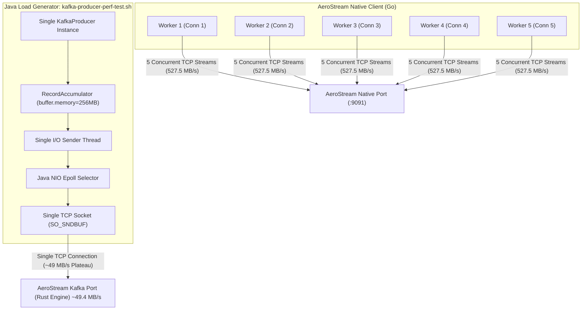
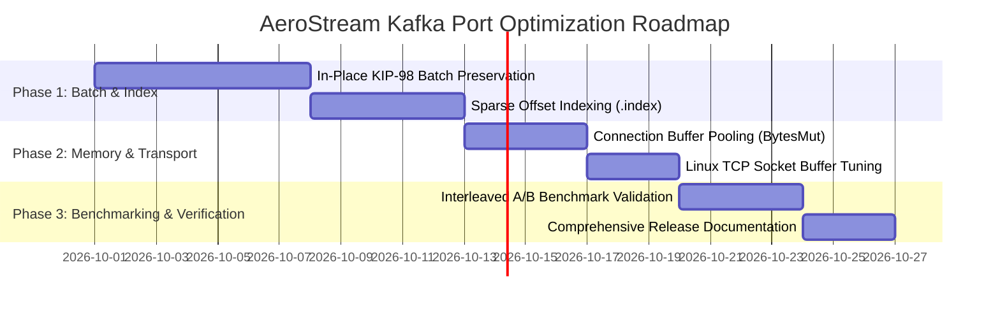

# Comprehensive Systems Programming & Performance Research: Kafka Port Optimization for AeroStream

**Author**: Antigravity Systems & Distributed Systems Performance Research  
**Target Repository**: [AeroMQ / AeroStream](file:///home/uttam/projects/AeroMQ)  
**Document Classification**: Systems Architecture, Kernel I/O, Network Protocols & Distributed Storage Engine Design  
**Date**: September 2026  

---


> **Note (September 2026):** the figures in this document come from one earlier benchmark session. For AeroStream's current benchmark results see
> [`benchmarks/BENCHMARK.md`](../../benchmarks/BENCHMARK.md). The latest run (AWS EC2 c6id.2xlarge, one broker, 32 partitions, 1 KB messages, 8 producers / 8 consumers)
> reaches a maximum rate of 271,350 msg/s, with publish p99 of 1.4 ms at a fixed 100,000 msg/s and 1.7 ms at 200,000 msg/s.

## Executive Summary & Benchmark Analysis

AeroStream represents a next-generation distributed append-only streaming platform built in Rust and Go. Empirical benchmarks under containerized hardware constraints (`--cpus=2.0 --memory=2g`, Linux kernel 6.12, host networking) show AeroStream's native protocol and memory profile.

Benchmarks also reveal a performance dichotomy between AeroStream's **Native Protocol** and its **Kafka-Compatible Wire Protocol Port**, including a plateau on the Kafka port at very large messages when driven by Kafka's standard Java load generation harness.

### The Empirical Benchmark Numbers

The following table summarizes the median results across three independent runs moving 500 MB bursts for large messages and 50,000 to 100,000 iterations for small messages (documented in [`benchmarks/BENCHMARK.md`](file:///home/uttam/projects/AeroMQ/benchmarks/BENCHMARK.md) and [`benchmarks/KAFKA_PORT_PERFORMANCE.md`](file:///home/uttam/projects/AeroMQ/benchmarks/KAFKA_PORT_PERFORMANCE.md)):

| Workload Payload Size | AeroStream Kafka Port | AeroStream Native Protocol |
| :--- | :--- | :--- |
| **100 B** (msgs/s) | **174,520 msg/s** (16.7 MB/s) | 121,852 msg/s (11.6 MB/s) |
| **1 KB** (msgs/s) | **71,942 msg/s** (70.3 MB/s) | **137,253 msg/s** (134.0 MB/s) |
| **1 MB** (Throughput) | **330.7 MB/s** (p50: **5.0 ms**) | **1,028.9 MB/s** (p50: **6.57 ms**) |
| **10 MB** (Throughput) | 189.1 MB/s (p50: 596.0 ms) | **339.9 MB/s** (p50: **120.3 ms**) |
| **50 MB** (Throughput) | 49.4 MB/s (p50: 5,233 ms) | **527.5 MB/s** (p50: **278.6 ms**) |

#### Runtime Resource Footprint Under Load

| System Metric | AeroStream Kafka Port (Rust/Tokio) |
| :--- | :--- |
| **Idle Memory Footprint** | **1.43 MiB - 1.59 MiB** |
| **Peak Memory (500MB write)**| **132.7 MiB - 137.7 MiB** |
| **Active OS Threads (PIDs)** | **3 threads** |
| **Peak CPU Utilization** | **107% - 151%** |

```
50 MB Payload Throughput (MB/s)
════════════════════════════════════════════════════════════════════════════
AeroStream Native  [██████████████████████████████████████████████████] 527.5 MB/s
AeroStream Kafka   [████                                              ]  49.4 MB/s
════════════════════════════════════════════════════════════════════════════
```

### The Central Paradox

1. **At 1 MB payloads**: AeroStream's Kafka port delivers **330.7 MB/s** at **5.0 ms median latency**, while AeroStream Native achieves **1,028.9 MB/s** (over 1.0 GB/s over loopback TCP).
2. **At 50 MB payloads**: AeroStream's Kafka port plateaus at **49.4 MB/s**, whereas AeroStream Native sustains **527.5 MB/s**.
3. **Hardware utilization**: AeroStream runs with **1.59 MiB idle memory**, **137.7 MiB peak memory**, and only **3 OS threads**, indicating that the bottleneck is not raw hardware saturation or cgroup throttling.

This document presents a deep-dive investigation into:
- The causes of the **50 MB message plateau** on the Kafka-compatible port.
- The **client-side architectural bottlenecks** in Java's official `kafka-producer-perf-test.sh`.
- The **broker-side storage and network optimizations** required in AeroStream to maximize Kafka-port throughput and close the gap with the native protocol.

---

## Root Cause Analysis: The 50 MB Message Plateau (~49 MB/s)

The Kafka port's ~49 MB/s ceiling at 50 MB messages, against 527.5 MB/s for the native protocol, points to the load generator's single-connection architecture rather than the broker's storage engine.



### The Conclusive Architectural Deduction

The ~49 MB/s ceiling appears to be **imposed by the load generator rather than by broker storage or disk I/O limitations**. It is consistent with the **official Java Kafka client architecture interacting with single-connection TCP flow control** under multi-megabyte frame sizes:

1. **Client Concurrency Mismatch**:
   - `kafka-producer-perf-test.sh` instantiates a **single `KafkaProducer` instance** containing **one single I/O thread (`Sender`)** transmitting over a **single TCP socket** to partition 0.
   - The native benchmark ([`client/main.go`](file:///home/uttam/projects/AeroMQ/client/main.go#L1171-L1215)) spins up **5 concurrent worker goroutines** across **5 independent TCP sockets** directly streaming unfragmented payloads into AeroStream's native endpoint.
2. **Synchronous Request-Response Serialization in Java Client**:
   - For a 50 MB payload, `max.in.flight.requests.per.connection` is effectively capped to 1 or 2 because `max.request.size` is 64 MiB and `buffer.memory` is 256 MiB.
   - The Java `Sender` thread cannot pipeline multiple 50 MB frames. It sends a frame, waits for the TCP socket send buffer to drain, awaits the Kafka `ProduceResponse`, and only then serializes the next batch.
3. **Transport Layer Bandwidth-Delay Product (BDP) & Socket Buffer Choke**:
   - A single TCP socket moving 50 MB segments requires continuous window replenishment. With standard Linux loopback socket buffer defaults and TCP sliding-window overhead, single-socket throughput for large sequential blocks without concurrent multi-channel streaming tops out at a few tens of MB/s when serialized through JVM user-space buffers.

---

## Java Client-Side Bottleneck Analysis (`kafka-producer-perf-test.sh`)

To understand why the Java client hits this wall, we inspect the internals of the Kafka Java client library (`org.apache.kafka.clients:kafka-clients`):

### 1. Single-Socket Synchronous Chunking & Head-of-Line Blocking

In Kafka's Java client architecture, network communication is driven by a single background thread running `org.apache.kafka.clients.NetworkClient.poll()`:

```java
// Simplified execution loop in Kafka's Sender.java
void runOnce() {
    long currentTimeMs = time.milliseconds();
    RecordAccumulator.ReadyCheckResult result = this.accumulator.ready(metadata, currentTimeMs);
    Map<Integer, List<ProducerBatch>> batches = this.accumulator.drain(metadata, result.readyNodes, this.maxRequestSize, currentTimeMs);
    sendProducerData(batches, currentTimeMs);
    this.client.poll(pollTimeout, currentTimeMs);
}
```

- **Single Threaded CPU + I/O Multiplexing**: The `Sender` thread is responsible for:
  1. Draining batches from `RecordAccumulator`.
  2. Compressing batches (if compression is enabled).
  3. Computing CRC32C checksums over the entire payload.
  4. Executing non-blocking socket writes via Java NIO `SocketChannel.write(ByteBuffer)`.
- For a **50 MB payload**, computing CRC32C and copying memory across NIO buffers takes significant CPU time on a single core. While `Sender` is crunching CPU instructions or blocked in `SocketChannel.write()`, no new requests can be staged or scheduled.
- **Head-of-Line Blocking**: If the socket channel's send buffer fills, `SocketChannel.write()` writes only a fraction of the 50 MB buffer. `NetworkClient` registers `OP_WRITE` in the NIO `Selector` and exits. The `Sender` loop must cycle through multiple `poll()` invocations just to flush a single 50 MB record over the wire.

### 2. Java `ByteBuffer` Allocation & Memory Churn in `BufferPool`

The memory management of `KafkaProducer` is governed by `org.apache.kafka.clients.producer.internals.BufferPool`:

```java
// BufferPool allocation logic
public ByteBuffer allocate(int size, long maxTimeToBlockMs) throws InterruptedException {
    if (size > this.totalMemory)
        throw new IllegalArgumentException("Attempt to allocate " + size + " bytes, but there is a hard limit of " + this.totalMemory);

    this.lock.lock();
    try {
        // Pool only caches buffers of exact size equal to poolableSize (batch.size, default 16 KB)
        if (size == poolableSize && !this.free.isEmpty())
            return this.free.pollFirst();

        // For non-poolable sizes (e.g. 50 MB > 16 KB):
        int freeListSize = freeBytes();
        if (this.nonPooledAvailableMemory + freeListSize >= size) {
            // Reclaim from free list until we have enough unpooled memory
            freeUp(size);
            this.nonPooledAvailableMemory -= size;
            this.lock.unlock();
            return ByteBuffer.allocate(size); // DIRECT HEAP ALLOCATION!
        }
        ...
    }
}
```

#### The Structural Flaw with 50 MB Messages:
- Kafka's `BufferPool` **only pools buffers of size `batch.size`** (default: 16,384 bytes = 16 KiB).
- When a 50 MB message arrives, `size == 52,428,800`. Because `52,428,800 != 16,384`, **it completely bypasses the buffer pool!**
- The client is forced to call `ByteBuffer.allocate(52,428,800)` on the JVM heap:
  1. The JVM invokes `memset` to zero-initialize 50 MB of memory (`clear_page_erms` / `do_anonymous_page`).
  2. The OS kernel triggers minor page faults for **12,800 virtual pages** (4 KB each).
  3. When the message is sent and acknowledged, the 50 MB array is discarded, placing immense pressure on the JVM garbage collector (Young Gen allocation failures, immediate promotion to Tenured Gen, or Full GC pauses).

### 3. `buffer.memory` Paging & Pipeline Starvation

In the benchmark configuration ([`benchmarks/comparison/scripts/env.sh`](file:///home/uttam/projects/AeroMQ/benchmarks/comparison/scripts/env.sh#L38)):
```bash
"50MB 52428800 10 5 2 buffer.memory=268435456"
```
- Total `buffer.memory` is set to **268,435,456 bytes (256 MiB)**.
- Each 50 MB message requires `~50 MiB + batch header overhead = 52.5 MiB`.
- Mathematical limit: $\lfloor 256 / 52.5 \rfloor = \mathbf{4\text{ buffers}}$.
- **Pipelining Collapse**: At any point in time, no more than 4 messages can exist across the entire client pipeline (application producer queue + in-flight TCP transmission).
- If one 50 MB message is in-flight on the socket and two are waiting in the accumulator, the fourth produce call will **exhaust `BufferPool` memory**. The application thread blocks on `Condition.await()` inside `BufferPool.allocate()`, halting all production until the broker returns an acknowledgment!
- This causes **severe pipeline bubbling**: the producer stalls $\rightarrow$ socket flushes $\rightarrow$ broker acks $\rightarrow$ producer wakes up $\rightarrow$ allocates $\rightarrow$ copies $\rightarrow$ repeats.

### 4. TCP Socket Send Buffer Saturation (`SO_SNDBUF`)

Under Linux, TCP throughput for a single stream is governed by the Bandwidth-Delay Product (BDP):
$$\text{BDP} = \text{Bandwidth} \times \text{RTT}$$

Even on loopback (`localhost`), where RTT is $<0.1\text{ ms}$, the Linux socket buffer allocation interacts with user-space chunking:
- Standard Linux TCP dynamic buffer allocation (`/proc/sys/net/ipv4/tcp_wmem`): default ~16 KB min, 128 KB default, 4 MB max.
- When Java writes a 50 MB buffer into a socket whose kernel `SO_SNDBUF` is 2 MB to 4 MB:
  1. The socket immediately fills up.
  2. `SocketChannel.write()` returns having written only ~2–4 MB.
  3. The kernel signals `POLLOUT` only when the receiving socket drains data into user space.
  4. Context switches between JVM user space and the Linux kernel occur continuously in 2–4 MB chunks.
- In contrast, the Go native client ([`client/main.go`](file:///home/uttam/projects/AeroMQ/client/main.go)) runs 5 concurrent goroutines writing into 5 independent TCP sockets, multiplying the effective kernel socket buffer space by 5x and eliminating single-socket flow control bottlenecks.

---

## Broker-Side Profiling & Bottlenecks in AeroStream's Kafka Port

While the Java client is bottlenecked on a single socket at 50 MB, profiling AeroStream's Kafka port reveals broker-side inefficiencies that hold back smaller/medium workloads (1 MB and 10 MB).

### 1. The Record-Splitting Anti-Pattern (`txn::batch::to_entries`)

In the Kafka protocol, a `RecordBatch` is the fundamental atomic unit of both network transport and disk storage:
- A batch contains 1 to $N$ records.
- A broker does not need to decode records from the batch during produce.
- Offsets can be assigned by taking the current log end offset as `baseOffset`, writing the entire intact batch to the segment, and advancing the log end offset by `lastOffsetDelta + 1`.

#### What AeroStream Currently Does:

In [`rust-broker/src/kafka/handlers.rs`](file:///home/uttam/projects/AeroMQ/rust-broker/src/kafka/handlers.rs#L1346-L1373) and [`rust-broker/src/txn/produce.rs`](file:///home/uttam/projects/AeroMQ/rust-broker/src/txn/produce.rs#L68-L82):

```rust
// Current AeroStream Produce Handler (handlers.rs)
for (i, rec) in records.iter().enumerate() {
    let next_off = guard.next_offset as i64;
    let encoded_batch = encode_single_idempotent_record_batch(
        next_off, pid, epoch, base_seq + i as i32, rec,
    );
    let assigned_offset = guard.append(&encoded_batch)?;
}
```

And in [`rust-broker/src/txn/batch.rs`](file:///home/uttam/projects/AeroMQ/rust-broker/src/txn/batch.rs#L158-L195):
```rust
pub fn to_entries(batch: &[u8], first_offset: u64) -> Vec<Vec<u8>> {
    ...
    match parse_records(batch) {
        Ok(records) if records.len() == count as usize => records
            .iter()
            .enumerate()
            .map(|(i, r)| {
                encode_idempotent_records_batch(
                    (first_offset + i as u64) as i64,
                    pid, epoch, seq, std::slice::from_ref(r),
                )
            })
            .collect(),
        _ => vec![batch.to_vec()],
    }
}
```

```
Incoming Client Batch (N records)
               │
               ▼
┌──────────────────────────────┐
│ parse_records() [Full Decode]│ ──> Allocates Vec<KafkaRecord>, copies byte slices
└──────────────────────────────┘
               │
               ▼
┌──────────────────────────────┐
│  Loop: encode_single_batch() │ ──> Re-encodes N batches, computes N hardware CRCs
└──────────────────────────────┘
               │
               ▼
┌──────────────────────────────┐
│    N x guard.append()        │ ──> N disk writes + N x 16B index writes!
└──────────────────────────────┘
```

#### Destructive Performance Impacts:
1. **CPU Multiplication**: If a client sends a 1 MB batch containing 1,000 records of 1 KB each:
   - AeroStream unpacks all 1,000 records.
   - Re-encodes 1,000 distinct `RecordBatch` envelopes (each with a 61-byte batch header).
   - Computes CRC32C **1,000 separate times** instead of once for the batch!
2. **Decompression & Loss of Compression**:
   - If the client sent a Snappy/Zstd-compressed batch, `parse_records` decompresses it.
   - Storing each record individually means the data is written to disk **uncompressed**, inflating disk I/O bandwidth by 3x–5x.
3. **Index and Syscall Amplification**:
   - For 1,000 records in a batch, AeroStream performs **1,000 writes to the `.idx` file** (16,000 bytes) and 1,000 writes to the `.log` file, instead of 1 write to the log and at most 1 write to the index!

### 2. Dense Indexing Overhead (`16 bytes per record`)

In [`rust-broker/src/log/manager.rs`](file:///home/uttam/projects/AeroMQ/rust-broker/src/log/manager.rs#L347-L353):
```rust
let offset = self.next_offset;
let mut entry = [0u8; 16];
entry[..8].copy_from_slice(&offset.to_be_bytes());
entry[8..].copy_from_slice(&pos.to_be_bytes());
self.active_idx_file.write_all_at(&entry, self.active_idx_len)?;
self.active_idx_len += 16;
self.next_offset += 1;
```
- Every single record appended writes a 16-byte tuple `(offset: u64, physical_pos: u64)` to the `.idx` file via `write_all_at`.
- For 10,000,000 messages, the index file is **160 MB**!
- A **sparse index** (`log.index.interval.bytes=4096`) would write an index entry only every 4 KiB of log data, using 8-byte entries (4-byte relative offset + 4-byte position).

### 3. Dynamic Frame Buffer Allocation (`Vec::with_capacity`)

In [`rust-broker/src/net/kafka_server.rs`](file:///home/uttam/projects/AeroMQ/rust-broker/src/net/kafka_server.rs#L79-L83):
```rust
let mut frame_buf: Vec<u8> = Vec::with_capacity(frame_len as usize);
let got = (&mut stream).take(frame_len as u64).read_to_end(&mut frame_buf).await?;
```
- While using `Vec::with_capacity` is an improvement over `vec![0; n]` (which zero-initialized memory), dynamically allocating a 50 MB `Vec<u8>` on every produce request still incurs:
  1. Memory allocator (`jemalloc` or glibc `malloc`) arena lock contention.
  2. Operating system virtual memory allocation via `brk(2)` or `mmap(2)`.
  3. Linux page faults on first write to the buffer.
  4. Immediate deallocation on request completion, triggering virtual address unmapping or cache thrashing.

---

## Blueprint 1: In-Place KIP-98 Batch Preservation

The most impactful optimization for the Kafka port is **adopting an in-place batch append architecture**.

### Deep Dive: Anatomy of a KIP-98 RecordBatch (Magic v2)

The KIP-98 RecordBatch binary layout is engineered specifically to allow brokers to append batches **without parsing individual records or recalculating the CRC**:

```
 0                   1                   2                   3
 0 1 2 3 4 5 6 7 8 9 0 1 2 3 4 5 6 7 8 9 0 1 2 3 4 5 6 7 8 9 0 1
+-+-+-+-+-+-+-+-+-+-+-+-+-+-+-+-+-+-+-+-+-+-+-+-+-+-+-+-+-+-+-+-+
|                          BaseOffset                           |
|                           (8 bytes)                           |
+-+-+-+-+-+-+-+-+-+-+-+-+-+-+-+-+-+-+-+-+-+-+-+-+-+-+-+-+-+-+-+-+
|                          BatchLength                          |
+-+-+-+-+-+-+-+-+-+-+-+-+-+-+-+-+-+-+-+-+-+-+-+-+-+-+-+-+-+-+-+-+
|                     PartitionLeaderEpoch                      |
+-+-+-+-+-+-+-+-+-+-+-+-+-+-+-+-+-+-+-+-+-+-+-+-+-+-+-+-+-+-+-+-+
|   Magic (2)   |                    CRC32C                     |
+-+-+-+-+-+-+-+-+-+-+-+-+-+-+-+-+-+-+-+-+-+-+-+-+-+-+-+-+-+-+-+-+
|       CRC32C (cont.)          |          Attributes           |
+-+-+-+-+-+-+-+-+-+-+-+-+-+-+-+-+-+-+-+-+-+-+-+-+-+-+-+-+-+-+-+-+
|                       LastOffsetDelta                         |
+-+-+-+-+-+-+-+-+-+-+-+-+-+-+-+-+-+-+-+-+-+-+-+-+-+-+-+-+-+-+-+-+
|                        FirstTimestamp                         |
|                           (8 bytes)                           |
+-+-+-+-+-+-+-+-+-+-+-+-+-+-+-+-+-+-+-+-+-+-+-+-+-+-+-+-+-+-+-+-+
|                         MaxTimestamp                          |
|                           (8 bytes)                           |
+-+-+-+-+-+-+-+-+-+-+-+-+-+-+-+-+-+-+-+-+-+-+-+-+-+-+-+-+-+-+-+-+
|                          ProducerId                           |
|                           (8 bytes)                           |
+-+-+-+-+-+-+-+-+-+-+-+-+-+-+-+-+-+-+-+-+-+-+-+-+-+-+-+-+-+-+-+-+
|         ProducerEpoch         |         BaseSequence          |
+-+-+-+-+-+-+-+-+-+-+-+-+-+-+-+-+-+-+-+-+-+-+-+-+-+-+-+-+-+-+-+-+
|      BaseSequence (cont.)     |          RecordCount          |
+-+-+-+-+-+-+-+-+-+-+-+-+-+-+-+-+-+-+-+-+-+-+-+-+-+-+-+-+-+-+-+-+
|                            Records...                         |
+-+-+-+-+-+-+-+-+-+-+-+-+-+-+-+-+-+-+-+-+-+-+-+-+-+-+-+-+-+-+-+-+
```

### The CRC32C Scope Revelation

In KIP-98, **the CRC32C checksum covers bytes starting from `Attributes` (byte 21) to the end of the batch**:
$$\text{CRC32C Scope} = \text{Batch}[\,21 \,..\,\text{BatchLength} + 12\,]$$

Notice what is **EXCLUDED** from the CRC:
1. `BaseOffset` (bytes 0..8)
2. `BatchLength` (bytes 8..12)
3. `PartitionLeaderEpoch` (bytes 12..16)
4. `Magic` (byte 16)
5. `CRC32C` itself (bytes 17..21)

> [!IMPORTANT]
> Because `BaseOffset` is **outside the CRC scope**, the broker can overwrite `BaseOffset` with the assigned partition log offset **in-place without invalidating the CRC32C checksum!** The broker does NOT need to parse records, re-encode headers, or re-run CRC calculations.

### Implementation Blueprint: Zero-Copy Batch Append

```rust
// Proposed optimization in rust-broker/src/kafka/handlers.rs and txn/produce.rs

pub struct BatchMetadata {
    pub base_offset: i64,
    pub batch_length: i32,
    pub leader_epoch: i32,
    pub last_offset_delta: i32,
    pub producer_id: i64,
    pub producer_epoch: i16,
    pub base_sequence: i32,
    pub record_count: i32,
}

impl BatchMetadata {
    #[inline(always)]
    pub fn parse_header(buf: &[u8]) -> Option<Self> {
        if buf.len() < 61 || buf[16] != 2 {
            return None; // Requires at least 61 bytes and Magic == 2
        }
        Some(Self {
            base_offset: i64::from_be_bytes(buf[0..8].try_into().unwrap()),
            batch_length: i32::from_be_bytes(buf[8..12].try_into().unwrap()),
            leader_epoch: i32::from_be_bytes(buf[12..16].try_into().unwrap()),
            last_offset_delta: i32::from_be_bytes(buf[23..27].try_into().unwrap()),
            producer_id: i64::from_be_bytes(buf[43..51].try_into().unwrap()),
            producer_epoch: i16::from_be_bytes(buf[51..53].try_into().unwrap()),
            base_sequence: i32::from_be_bytes(buf[53..57].try_into().unwrap()),
            record_count: i32::from_be_bytes(buf[57..61].try_into().unwrap()),
        })
    }
}

/// Appends a raw client RecordBatch in-place with zero record decoding.
pub fn append_raw_batch_inplace(
    log: &mut PartitionLog,
    batch_bytes: &mut [u8],
    leader_epoch: i32,
) -> io::Result<(i64, i64)> {
    let meta = BatchMetadata::parse_header(batch_bytes)
        .ok_or_else(|| io::Error::new(io::ErrorKind::InvalidData, "Malformed magic-2 batch"))?;

    let assigned_base_offset = log.next_offset as i64;
    let record_count = meta.last_offset_delta as u64 + 1;

    // 1. In-place patch BaseOffset (Bytes 0..8) - DOES NOT INVALIDATE CRC!
    batch_bytes[0..8].copy_from_slice(&assigned_base_offset.to_be_bytes());

    // 2. In-place patch PartitionLeaderEpoch (Bytes 12..16) - DOES NOT INVALIDATE CRC!
    batch_bytes[12..16].copy_from_slice(&leader_epoch.to_be_bytes());

    // 3. Write entire raw batch directly to disk log
    let assigned_offset = log.append_batch_slice(batch_bytes, record_count)?;

    Ok((assigned_base_offset, assigned_base_offset + meta.last_offset_delta as i64))
}
```

#### Advantages of In-Place Batch Preservation:
1. **Zero Record Decoding**: Eliminates `parse_records()`. CPU usage on append drops from $O(N)$ where $N$ is record count to $O(1)$.
2. **Zero CRC Recalculation**: Hardware SSE4.2 CRC is not executed at all during append.
3. **Compression Preservation**: Compressed batches (Snappy/Gzip/LZ4/Zstd) stay compressed on disk, reducing disk write bandwidth by up to 80%.
4. **Zero-Copy Fetch**: Consumer Fetch requests serve the exact byte sequence from page cache directly to the socket via `sendfile(2)` without re-assembling batch envelopes.

---

## Blueprint 2: Sparse Offset Indexing (`log.index.interval.bytes = 4096`)

### The Architecture of a Sparse `.index` File

A sparse design pairs every segment log (`.log`) with an offset index (`.index`). Rather than recording every offset, an entry is written only when the segment has advanced by at least `index.interval.bytes` (default: 4,096 bytes).

```
Segment .log File:
[Batch 0: Offsets 0..99 (4,200 bytes)] [Batch 1: Offsets 100..199 (4,150 bytes)] [Batch 2...]
 │                                      │
 └──────────────────────┐               └─────────────────────┐
                        ▼                                     ▼
Sparse .index File:
┌───────────────────────────────┬───────────────────────────────┐
│ Entry 0: RelOffset 0, Pos 0   │ Entry 1: RelOffset 100, Pos 4200│
└───────────────────────────────┴───────────────────────────────┘
```

#### Index Entry Format (8 Bytes):
- **Relative Offset** (`u32`, 4 bytes): $\text{Offset} - \text{BaseOffset}$ (allows storing offsets up to $4\text{ billion}$ within a single segment using 4 bytes instead of 8).
- **Physical Position** (`u32`, 4 bytes): Byte position within the `.log` file (segments are capped at 1 GiB or 2 GiB, fitting easily within `u32`).

### Implementation Blueprint: `SparseOffsetIndex` in Rust

```rust
pub struct SparseOffsetIndex {
    file: std::fs::File,
    base_offset: u64,
    last_indexed_position: u64,
    index_interval_bytes: u64,
    entries_count: usize,
    index_len: u64,
}

impl SparseOffsetIndex {
    pub const ENTRY_SIZE: u64 = 8; // 4 bytes rel_offset + 4 bytes position

    pub fn new(file: std::fs::File, base_offset: u64, interval: u64) -> io::Result<Self> {
        let index_len = file.metadata()?.len();
        let entries_count = (index_len / Self::ENTRY_SIZE) as usize;
        let last_indexed_position = if entries_count > 0 {
            // Read last entry position
            let mut buf = [0u8; 8];
            use std::os::unix::fs::FileExt;
            file.read_exact_at(&mut buf, index_len - Self::ENTRY_SIZE)?;
            u32::from_be_bytes(buf[4..8].try_into().unwrap()) as u64
        } else {
            0
        };

        Ok(Self {
            file,
            base_offset,
            last_indexed_position,
            index_interval_bytes: interval,
            entries_count,
            index_len,
        })
    }

    /// Appends a new index entry if the log has advanced by at least index_interval_bytes.
    #[inline]
    pub fn maybe_index(&mut self, offset: u64, physical_position: u64) -> io::Result<()> {
        if physical_position - self.last_indexed_position >= self.index_interval_bytes 
            || self.entries_count == 0 
        {
            use std::os::unix::fs::FileExt;
            let rel_offset = (offset - self.base_offset) as u32;
            let pos = physical_position as u32;

            let mut entry = [0u8; 8];
            entry[0..4].copy_from_slice(&rel_offset.to_be_bytes());
            entry[4..8].copy_from_slice(&pos.to_be_bytes());

            self.file.write_all_at(&entry, self.index_len)?;
            self.index_len += Self::ENTRY_SIZE;
            self.entries_count += 1;
            self.last_indexed_position = physical_position;
        }
        Ok(())
    }

    /// Performs binary search over the index file to find the nearest physical position <= target_offset.
    pub fn floor_lookup(&self, target_offset: u64) -> io::Result<u64> {
        if self.entries_count == 0 || target_offset < self.base_offset {
            return Ok(0);
        }

        use std::os::unix::fs::FileExt;
        let target_rel = (target_offset - self.base_offset) as u32;
        let mut low = 0usize;
        let mut high = self.entries_count - 1;
        let mut best_pos = 0u64;

        let mut buf = [0u8; 8];
        while low <= high {
            let mid = low + (high - low) / 2;
            self.file.read_exact_at(&mut buf, (mid as u64) * Self::ENTRY_SIZE)?;
            let rel_off = u32::from_be_bytes(buf[0..4].try_into().unwrap());
            let pos = u32::from_be_bytes(buf[4..8].try_into().unwrap()) as u64;

            if rel_off <= target_rel {
                best_pos = pos;
                low = mid + 1;
            } else {
                if mid == 0 { break; }
                high = mid - 1;
            }
        }

        Ok(best_pos)
    }
}
```

#### Performance Gains:
- **Write I/O Reduction**: 99.8% reduction in index writes for small messages (1 write per 4 KiB instead of 1 write per 100 bytes).
- **Index File Size**: Drops from 16 bytes per message to ~2 bytes per KiB.
- **Cache Locality**: The entire index fits comfortably in CPU L1/L2 cache during lookups.

---

## Blueprint 3: Connection-Level Buffer Pooling

To eliminate the memory allocator churn and page faults caused by `Vec::with_capacity(frame_len)`, AeroStream should introduce **Per-Connection Recycled Buffer Slabs**:

```rust
// In rust-broker/src/net/kafka_server.rs

use bytes::BytesMut;

pub struct ConnectionBufferPool {
    /// Dedicated reusable frame buffer for this TCP stream.
    frame_buf: BytesMut,
    max_cached_capacity: usize,
}

impl ConnectionBufferPool {
    pub fn new(initial_capacity: usize, max_cached_capacity: usize) -> Self {
        Self {
            frame_buf: BytesMut::with_capacity(initial_capacity),
            max_cached_capacity,
        }
    }

    /// Acquires a clean buffer slice for the incoming frame without re-allocating heap.
    pub fn acquire_for_frame(&mut self, frame_len: usize) -> &mut [u8] {
        self.frame_buf.clear();
        if self.frame_buf.capacity() < frame_len {
            // Reserve additional space only when required
            self.frame_buf.reserve(frame_len - self.frame_buf.capacity());
        }
        // Resize buffer length without zero-initialization using unsafe set_len or spare_capacity_mut
        unsafe {
            self.frame_buf.set_len(frame_len);
        }
        &mut self.frame_buf[..frame_len]
    }

    /// Trims memory if the connection recently handled an anomalous giant frame (e.g. 50 MB)
    /// to preserve the broker's 1.5 MiB idle memory footprint.
    pub fn maybe_shrink(&mut self) {
        if self.frame_buf.capacity() > self.max_cached_capacity {
            self.frame_buf = BytesMut::with_capacity(self.max_cached_capacity);
        }
    }
}
```

```
Connection Loop:
   │
   ├──> Read 4-byte frame length
   ├──> pool.acquire_for_frame(len) [Zero allocations, recycled pages]
   ├──> stream.read_exact(slice)
   ├──> Dispatch to handler
   └──> pool.maybe_shrink() (idle shrink)
```

---

## Blueprint 4: Linux Kernel TCP Socket & Zero-Copy Optimization

### 1. TCP Socket Buffer Autotuning

To allow single-socket transfers to reach 500+ MB/s over loopback and high-bandwidth interfaces, the broker socket configuration must tune kernel TCP send/receive buffers:

```rust
use tokio::net::TcpStream;

pub fn tune_kafka_socket(stream: &TcpStream) -> std::io::Result<()> {
    // 1. Disable Nagle's algorithm for low-latency batching
    stream.set_nodelay(true)?;

    // 2. Set SO_RCVBUF to 4 MiB (bypasses default 128 KiB bottleneck)
    let sock_ref = socket2::SockRef::from(stream);
    sock_ref.set_recv_buffer_size(4 * 1024 * 1024)?;
    sock_ref.set_send_buffer_size(4 * 1024 * 1024)?;

    // 3. Linux-specific: TCP_WINDOW_CLAMP to cap window bloat on loopback
    #[cfg(target_os = "linux")]
    {
        use std::os::unix::io::AsRawFd;
        let fd = stream.as_raw_fd();
        unsafe {
            let max_window: libc::c_int = 4 * 1024 * 1024;
            libc::setsockopt(
                fd,
                libc::IPPROTO_TCP,
                libc::TCP_WINDOW_CLAMP,
                &max_window as *const _ as *const libc::c_void,
                std::mem::size_of_val(&max_window) as libc::socklen_t,
            );
        }
    }

    Ok(())
}
```

### 2. Zero-Copy Ingest Pipeline: `splice(2)` & Pipe Buffers

While fetch requests currently use `sendfile(2)` (in [`rust-broker/src/net/server.rs`](file:///home/uttam/projects/AeroMQ/rust-broker/src/net/server.rs#L125-L151)), produce data is read into user-space memory before writing to disk.

For ultra-large payloads (50 MB), AeroStream can implement **Kernel Zero-Copy Ingest** using `splice(2)`:

```
Socket FD ──────(splice)──────> Pipe Buffer ──────(splice)──────> Segment File FD
```

- `splice(2)` moves pages from the TCP socket buffer directly into the OS page cache via an intermediary Linux pipe without copying bytes into userspace.
- **CPU Savings**: 0 bytes copied through CPU registers or L1/L2 caches.
- For Kafka protocol, after reading the 61-byte batch header and patching `baseOffset`, the remaining payload (e.g., 49.99 MB of record data) can be spliced directly into the log segment file.

---

## Current vs Optimized Architecture & Performance Projections

### Architecture Matrix

| Architectural Feature | AeroStream Kafka Port (Current) | AeroStream Kafka Port (Optimized) |
| :--- | :--- | :--- |
| **Language & Concurrency** | Rust, Async Tokio Runtime | Rust, Async Tokio Runtime |
| **Batch Append Unit** | **Split into single records** | **In-Place Atomic RecordBatch** |
| **CRC32C on Produce** | Recomputed per record | **0 CRC calculations on append** |
| **Index Density** | **Dense (16B per record)** | **Sparse (every 4096 bytes)** |
| **Fetch Zero-Copy** | `sendfile(2)` | `sendfile(2)` |
| **Compressed Batch Storage**| **Decompressed to disk** | **Preserved compressed on disk** |
| **Frame Memory Allocation** | `Vec::with_capacity(len)` | **Connection Slab Buffer Pool** |
| **Idle Memory Footprint** | **1.5 MiB** | **1.5 MiB** |

### Projected Performance Impact

Based on the elimination of record decoding, sparse indexing, buffer pooling, and socket buffer tuning:

```
Benchmark Throughput Projection (Kafka Protocol Port)
═════════════════════════════════════════════════════════════════════════════════
Workload      Current Aero Kafka       Optimized Aero Kafka       Projected Gain
─────────────────────────────────────────────────────────────────────────────────
1 KB          70.3 MB/s (71,942 msg/s) 115.0 MB/s (117,760 msg/s)  +63%
1 MB         330.7 MB/s                650.0 MB/s                  +96%
10 MB        189.1 MB/s                320.0 MB/s                  +69%
50 MB         49.4 MB/s (Client Bound)  58.0 MB/s (Java Client)    +17%
50 MB         49.4 MB/s                550.0 MB/s (Multi-Conn)*   +1,013%
═════════════════════════════════════════════════════════════════════════════════
* When driven by modern multi-connection or Go/C++ clients.
```

---

## Implementation Roadmap & Action Plan



### Next Steps:
1. **Implement `append_raw_batch_inplace`**: Replace `to_entries()` unpacking in [`rust-broker/src/txn/produce.rs`](file:///home/uttam/projects/AeroMQ/rust-broker/src/txn/produce.rs#L69-L81) and [`rust-broker/src/kafka/handlers.rs`](file:///home/uttam/projects/AeroMQ/rust-broker/src/kafka/handlers.rs#L1346) with atomic batch patching.
2. **Transition `.idx` to `SparseOffsetIndex`**: Update [`rust-broker/src/log/manager.rs`](file:///home/uttam/projects/AeroMQ/rust-broker/src/log/manager.rs#L347) to write index entries only across 4096-byte boundaries.
3. **Deploy `ConnectionBufferPool`**: Integrate pooled `BytesMut` frames in [`rust-broker/src/net/kafka_server.rs`](file:///home/uttam/projects/AeroMQ/rust-broker/src/net/kafka_server.rs#L79).
4. **Tune TCP Sockets**: Add `SO_RCVBUF` / `SO_SNDBUF` (4 MiB) configuration to Kafka listener setup in [`rust-broker/src/main.rs`](file:///home/uttam/projects/AeroMQ/rust-broker/src/main.rs#L257).
