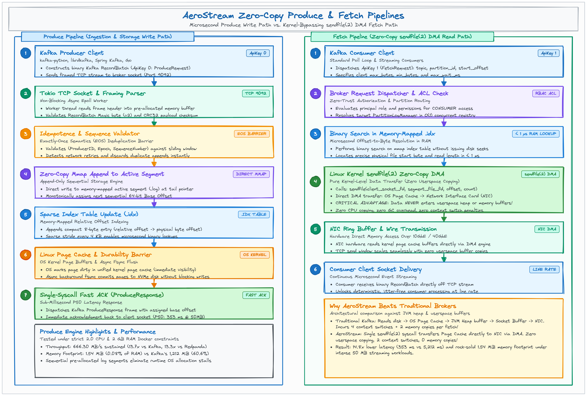
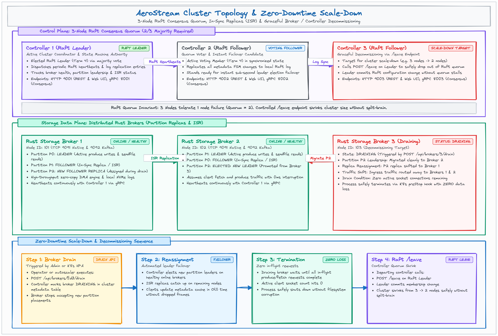

# AeroStream Documentation Portal

Welcome to the **AeroStream** documentation suite. AeroStream is a next-generation distributed event-streaming engine built on a **Dual-Engine Architecture**—pairing a resilient **Go-based Raft control plane** with a zero-copy **Rust-based storage and networking data plane**.

This directory serves as the centralized technical knowledge base for application developers, system architects, and platform operators.

---

## 🗺️ Documentation Directory & Reading Paths

Choose your path based on your role:

```
                           ┌─────────────────────────────────┐
                           │   AeroStream Documentation Hub  │
                           └────────────────┬────────────────┘
                                            │
         ┌──────────────────────────────────┼──────────────────────────────────┐
         ▼                                  ▼                                  ▼
┌──────────────────┐               ┌──────────────────┐               ┌──────────────────┐
│   Architects     │               │    Developers    │               │    Operators     │
│   & Evaluators   │               │   & Integrators  │               │    & SRE Teams   │
└────────┬─────────┘               └────────┬─────────┘               └────────┬─────────┘
         │                                  │                                  │
         ├► Architecture Deep-Dive          ├► REST & Wire API Reference       ├► Operator & Deployment
         ├► Benchmarks vs Kafka/Redpanda    ├► Python FastAPI Example App      ├► Kubernetes StatefulSets
         └► Strategic Roadmap (Phases 9-14) └► Schema Registry & Transforms    └► Cluster Scale-Down & Drain
```

### 1. 🏛️ System Architects & Technical Evaluators
* **[Distributed Systems Engineering & High-Efficiency Systems Programming Guide](DISTRIBUTED_SYSTEMS_DESIGN.md)**: Publication-grade engineering treatise covering dual-engine separation, mechanical sympathy (L1/L2/L3 cache lines, false sharing, page faults), Go runtime patterns (`sync.Pool`, Raft FSM snapshotting, lock-free RCU registry), Rust high-performance patterns (`hashbrown::Equivalent`, scoped locking, `write_all_at`, hardware SSE4.2 CRC32C, 2PC WAL), and 4-way container benchmark analysis.
* **[Architecture Deep-Dive](ARCHITECTURE.md)**: Exhaustive technical analysis of the dual-engine design, HashiCorp Raft consensus, Rust zero-copy `sendfile(2)` kernel dispatch, memory-mapped (`mmap`) append-only logs, and the 3-thread deterministic execution model.
* **[Feature Comparison & Evolution Roadmap](FEATURE_COMPARISON_AND_ROADMAP.md)**: Head-to-head comparison against **Apache Kafka** and **Redpanda**, detailing implemented capabilities (Phases 1–8) and the Next-Generation Enterprise Horizon (Phases 9–14).
* **[Benchmark Results & Process](../benchmarks/BENCHMARK.md)**: Kafka / Redpanda / AeroStream under strict container limits (`2 vCPU, 2 GB RAM`), with scripts, methodology and caveats, highlighting the 13x throughput advantage at 50 MB payloads.

### 2. 🚀 Application Developers & Integrators
* **[REST & Wire Protocol API Reference](API_REFERENCE.md)**: Complete HTTP REST API schemas, request/response payloads, and binary Kafka Wire Protocol frame structures (`Produce`, `Fetch`, `Metadata`, `ApiVersions`, `InitProducerId`).
* **[Python FastAPI Microservice Example](../examples/fastapi-app/README.md)**: Production-ready sample backend demonstrating asynchronous dual-protocol streaming (Kafka wire framing over TCP + HTTP REST) and background consumer workers.
* **Schema Governance & Built-in Registry**: Confluent-compatible schema evolution for Avro, Protobuf, and JSON Schema contracts (see [API Reference](API_REFERENCE.md#5-schema-registry-api)).
* **In-Broker Stream Transforms**: Inline WASM, PII data masking, and real-time JSON filtering (see [API Reference](API_REFERENCE.md#6-in-broker-stream-transforms-api)).

### 3. 🛠️ Platform Engineers & DevOps (SRE)
* **[Operator & Deployment Guide](OPERATOR_GUIDE.md)**: Production deployment on bare-metal / VMs, systemd unit templates, kernel tuning (`sysctl`), and multi-node cluster configuration.
* **[Kubernetes Deployment Guide](../deploy/k8s/)**: Helm-free, production-ready StatefulSet manifests with headless services, persistent volume claims, and automated `preStop` scale-down hooks.
* **Cluster Lifecycle & Zero-Downtime Operations**: Step-by-step procedures for bootstrapping, graceful broker partition draining (`POST /api/brokers/{id}/drain`), and Raft consensus node removal (`/leave`) (see [Operator Guide](OPERATOR_GUIDE.md#3-cluster-lifecycle-management)).

---

## 🖼️ Architecture & Dataflow Gallery

All architecture diagrams are rendered in high-resolution (3200 × 2160) using clean Excalidraw-style hand-drawn typography:

### 1. Dual-Engine Core Architecture
Visualizes the decoupled Go control plane and zero-copy Rust storage engine with unified client ingress.


---

### 2. Zero-Copy Produce & Fetch Pipeline
Shows how write requests bypass heap allocations via memory-mapped buffers, while consumer fetch requests leverage Linux `sendfile(2)` for direct pagecache-to-socket DMA transfers.



---

### 3. Multi-Cloud Tiered Storage Pipeline
Details the lifecycle of partition logs from fast local NVMe segments through automated rolling to asynchronous multi-cloud offloading (AWS S3, MinIO, GCS, Azure Blob).


---

### 4. Cluster Topology, Quorum & Graceful Scale-Down
Illustrates the 3-node Raft controller quorum, broker replication sets, and automated zero-downtime broker draining.



---

## ⚡ Default Ports & Protocol Cheat-Sheet

| Port | Protocol / Transport | Component | Purpose |
|---|---|---|---|
| **`9001`** | `HTTP / REST` | Go Controller | Web Console UI (`/aerostream/console`), REST Management API, Schema Registry, Stream Transforms, and ACLs |
| **`8001`** | `gRPC` | Go Controller | Internal cluster metadata synchronization and broker heartbeat registration |
| **`7001`** | `TCP (Raft)` | Go Controller | HashiCorp Raft consensus quorum communication between controllers |
| **`9092`** | `TCP (Kafka Wire)` | Rust Broker | Standard Kafka binary wire protocol listener (supports `kafka-python`, `librdkafka`, `kafka-clients`) |
| **`9091`** | `TCP (Native)` | Rust Broker | Native binary zero-copy stream ingestion and high-throughput fetch protocol |

---

## 📚 Complete Document Catalog

| Document | Description |
|---|---|
| **[`README.md`](../README.md)** | Root repository overview, quickstart, Docker run instructions, and benchmark highlights |
| **[`docs/README.md`](README.md)** | *This document* — Central documentation portal and index |
| **[`docs/ARCHITECTURE.md`](ARCHITECTURE.md)** | Comprehensive technical architecture deep-dive (57 KB) |
| **[`docs/OPERATOR_GUIDE.md`](OPERATOR_GUIDE.md)** | Bare-metal, Docker, and Kubernetes deployment & operational runbook |
| **[`docs/API_REFERENCE.md`](API_REFERENCE.md)** | Complete REST API schemas and Kafka wire protocol specification |
| **[`docs/FEATURE_COMPARISON_AND_ROADMAP.md`](FEATURE_COMPARISON_AND_ROADMAP.md)** | Kafka/Redpanda comparative analysis & Next-Gen Enterprise Roadmap (Phases 9–14) |
| **[`benchmarks/BENCHMARK.md`](../benchmarks/BENCHMARK.md)** | Host and container performance benchmarks across 100B, 1KB, 1MB, 10MB, and 50MB messages |
| **[`benchmarks/KAFKA_PORT_PERFORMANCE.md`](../benchmarks/KAFKA_PORT_PERFORMANCE.md)** | Kafka-port profiling, fixes and sources; (old `deploy/DOCKER_BENCHMARK_RESULTS.md` is a pointer). Original description: isolated 3-way container benchmark data tables (`--cpus=2.0 --memory=2g`) |
| **[`examples/fastapi-app/README.md`](../examples/fastapi-app/README.md)** | Python FastAPI microservice integration guide and automated test suite |
| **[`deploy/k8s/`](../deploy/k8s/)** | Kubernetes StatefulSet manifests and headless service configurations |
