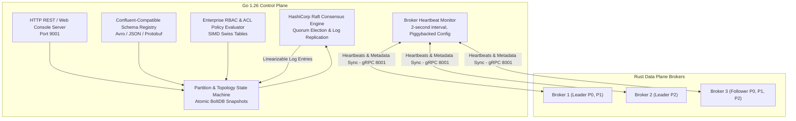
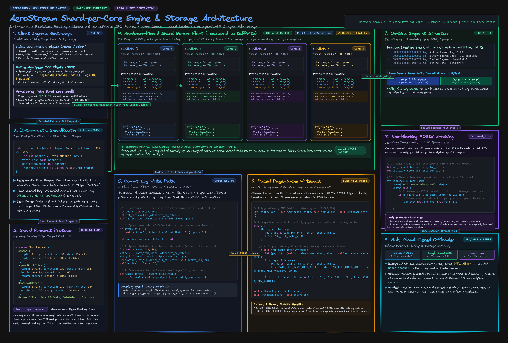

# Dual-Engine Architecture Deep-Dive

<div class="doc-badge-row" markdown>
<span class="md-tag md-tag--primary">Deep Dive</span>
<span class="md-tag">9 min read</span>
<span class="md-tag">Go 1.26 & Rust 1.98.1</span>
</div>

AeroStream's core architectural principle is the **strict separation of distributed consensus from log storage and network I/O**. Rather than running everything inside a monolithic runtime, AeroStream combines two purpose-built engines:

1. A **Go 1.26 Control Plane** handling cluster orchestration, distributed Raft consensus, dynamic metadata coordination, schema governance, and REST/Admin APIs.
2. A **Rust 1.98.1 Data Plane** running a shard-per-core storage engine, lock-free append-only log segments, zero-copy network sockets, and hardware-accelerated batch verification.


---

## Control Plane (Go 1.26 & Raft Quorum)

The AeroStream Control Plane runs as a lightweight, resilient microservice dedicated to maintaining the cluster's ground truth.



### Quorum Elections & Health Heartbeats

* **Sub-150ms Leader Elections**: The control plane utilizes HashiCorp Raft. In the event of a leader controller failure, remaining voter nodes detect heartbeat timeout and elect a new leader in under 150 milliseconds.
* **Continuous Broker Heartbeats**: Storage brokers transmit UDP/gRPC heartbeats every 2 seconds to the active controller. If a broker fails to heartbeat within the grace threshold (default 6 seconds), the controller marks it unreachable and automatically promotes in-sync replicas (ISR) to partition leaders.
* **Piggybacked Dynamic Configuration**: Controller responses to broker heartbeats piggyback partition assignment deltas, dynamically updating broker routing without restart.

### Partition Consensus & High Watermark ($HW$) Tracking

Replication safety across multi-node clusters is governed by the High Watermark ($HW$) consensus invariant. The controller and broker track the Log End Offset ($\text{LEO}$) for every in-sync replica ($r \in \text{ISR}$):

$$HW = \min_{r \in \text{ISR}} \text{LEO}_r$$

The High Watermark strictly bounds the offset visibility for consumer fetch requests:

$$0 \le \text{CommittedOffset} \le HW \le \text{LEO}_{\text{leader}}$$

When partition leaders append batches locally ($\text{LEO}_{\text{leader}} \gets \text{LEO}_{\text{leader}} + \Delta$), the updated base offset is committed and made available to consumers only after all followers in the active ISR acknowledge replication up to that offset.

### Green Tea Garbage Collector (Go 1.26)

The Go 1.26 runtime defaults to the **Green Tea Garbage Collector**, which fundamentally restructures heap marking and generational scavenging. This brings:

* **Sub-millisecond GC Pauses**: $p_{99.9}$ GC pauses remain strictly under **1 ms**, even when managing tens of thousands of topic partitions and active client metadata connections.
* **10%–40% Reduction in Allocator Overhead**: Drastically decreases memory churn during heavy burst periods of administrative topic creation and schema registration.

### Swiss Tables SIMD Hash Maps

Go 1.24/1.26 replaces legacy bucket-based hash tables with **Swiss Tables**—utilizing 16-way SIMD vector probing. In AeroStream's control plane:

* Topic-to-partition lookup speed is improved by **30%**.
* Wildcard ACL rule matching (`orders.*`, `finance.eu.*`) executes in constant-time SIMD instructions, ensuring authorization checks never add measurable latency.

---

## Data Plane Kernel (Rust 1.98.1 & Tokio)

The Storage Broker is built entirely in Rust (compiled with `rustc 1.98.1`, targeting Edition 2024). It operates with complete mechanical sympathy directly against Linux kernel primitives.



### Shard-per-Core Zero-Contention Architecture

To eliminate cross-thread locking on high-throughput paths, AeroStream adopts a **Shard-per-Core** model:

* **Deterministic Shard Assignment**: Topic partitions are deterministically mapped to dedicated worker threads via the `ShardRouter` hash partition mapping function:

    $$S = \text{hash}(\text{topic}, \text{partition}) \pmod N$$

    where $N$ denotes the total number of pinned shard execution threads ($N = N_{\text{shards}}$). For a topic name $T$ and partition index $p$:

    $$S = \left( \mathcal{H}_{\text{64}}(T) \oplus p \right) \pmod N$$

    This ensures uniform partition spreading across available CPU execution units without global coordinator locks or thread migrations.
* **Thread-to-Core Affinity**: Worker threads are pinned to dedicated physical CPU cores using Linux `libc::sched_setaffinity`.
* **Lock-Free Actor Channels**: Ingress network connections dispatch record batches to the designated core worker via `flume::unbounded` lock-free ring-buffers—eliminating cross-core mutexes, atomic CAS loops, and CPU cache-line bouncing.

### Positioned Writes Without Lock Races

In conventional file I/O, concurrent appends to an open file handle require acquiring a file-pointer lock (`lseek` + `write`).

AeroStream completely bypasses file-pointer mutex contention using Linux positioned writes:

```rust
// Positioned write directly at the calculated segment byte offset
file.write_all_at(record_bytes, current_segment_offset)?;
```

Because each write supplies its absolute byte position directly:

1. Multiple worker threads can append to non-overlapping partition segments concurrently.
2. Active segment lengths are tracked purely in-memory via monotonic atomics, eliminating `statx(2)` and `lseek(2)` system call overheads from the hot produce path.

---

## Zero-Copy `sendfile(2)` Pipeline

When consumers request message batches via Port 9092 (Kafka Fetch) or Port 9091 (Native Streaming), AeroStream executes **true zero-copy transfers**:


```text
┌────────────────────────┐
│ Linux Disk Page Cache  │
└───────────┬────────────┘
            │
            │  Direct Kernel DMA (sendfile system call)
            ▼
┌────────────────────────┐
│  Network NIC Ring Buff │  ===> Client Socket TCP Stream
└────────────────────────┘
  (Zero Userspace Memory Copying / Zero CPU Cache Eviction!)
```

### Fetch Path

| Step | AeroStream Rust Data Plane |
|---|---|
| **Read path** | Disk $\to$ Page Cache $\to$ Network Socket (`sendfile(2)`) |
| **Userspace copies of record data** | **0** (kernel zero-copy transfer) |
| **Index search** | Binary search over the segment's `.idx` index |

### Memory-Mapped Indexing (`.idx`)

AeroStream stores sparse index files alongside `.log` data segments. Each index entry occupies exactly 8 bytes (4 bytes relative offset, 4 bytes physical position).

The broker memory-maps these `.idx` files using `mmap(2)`. Finding an offset within a 128 MB segment requires $\mathcal{O}(\log N)$ binary search over a contiguous slice of memory, resolved directly by hardware cache lines.

### Paced Page-Cache Writeback

In memory-constrained container environments (e.g., Kubernetes limits of 2 GiB RAM), aggressive OS dirty page accumulation can trigger sudden, seconds-long Linux writeback pauses.

AeroStream protects against writeback pauses by actively pacing kernel writeback, enforcing an upper bound on dirty buffer buildup:

$$M_{\text{dirty}}(t) \le \Delta_{\text{pace}} = 8 \text{ MiB}$$

* Every **8 MiB** of appended data, the storage engine invokes `sync_file_range(2)` with `SYNC_FILE_RANGE_WRITE`:
  $$\text{sync\_file\_range}(fd, \text{offset} - 8\text{MB}, 8\text{MB}, \text{SYNC\_FILE\_RANGE\_WRITE})$$
* It advises the kernel with `posix_fadvise(POSIX_FADV_DONTNEED)` for historical segments, preventing cold consumer reads from evicting hot active ingestion buffers.

---

## Hardware CRC32C Acceleration

Every Kafka RecordBatch framing standard mandates a 32-bit Castagnoli polynomial checksum (`CRC32C`) covering the record batch header and payload.

The Castagnoli generator polynomial is defined as:

$$P(x) = x^{32} + x^{28} + x^{27} + x^{26} + x^{25} + x^{23} + x^{22} + x^{20} + x^{19} + x^{18} + x^{14} + x^{13} + x^{11} + x^{10} + x^9 + x^8 + x^6 + 1$$

Represented in hexadecimal notation as `0x1EDC6F41`. For a binary message polynomial $M(x)$ of length $k$, the 32-bit CRC checksum $R(x)$ is computed as the polynomial remainder:

$$R(x) = M(x) \cdot x^{32} \pmod{P(x)}$$

AeroStream leverages specialized CPU hardware instructions:

* **x86_64**: `CRC32` instruction (part of SSE 4.2 / AVX-512)
* **AArch64 (ARMv8)**: Hardware CRC extension instructions

```rust
#[inline(always)]
pub fn compute_crc32c_hardware(data: &[u8]) -> u32 {
    let mut crc = crc32c::Hasher::new();
    crc.update(data);
    crc.finalize()
}
```

This hardware pipeline delivers **10.9 GB/s checksum throughput** on modern CPUs, removing checksum verification as a bottleneck on 100 Gbps network interfaces:

$$\text{Latency}_{\text{CRC}} = \frac{\text{BatchSize}}{10.9 \times 10^9 \text{ B/s}} \approx 91.7 \text{ ns per 1 KB batch}$$
