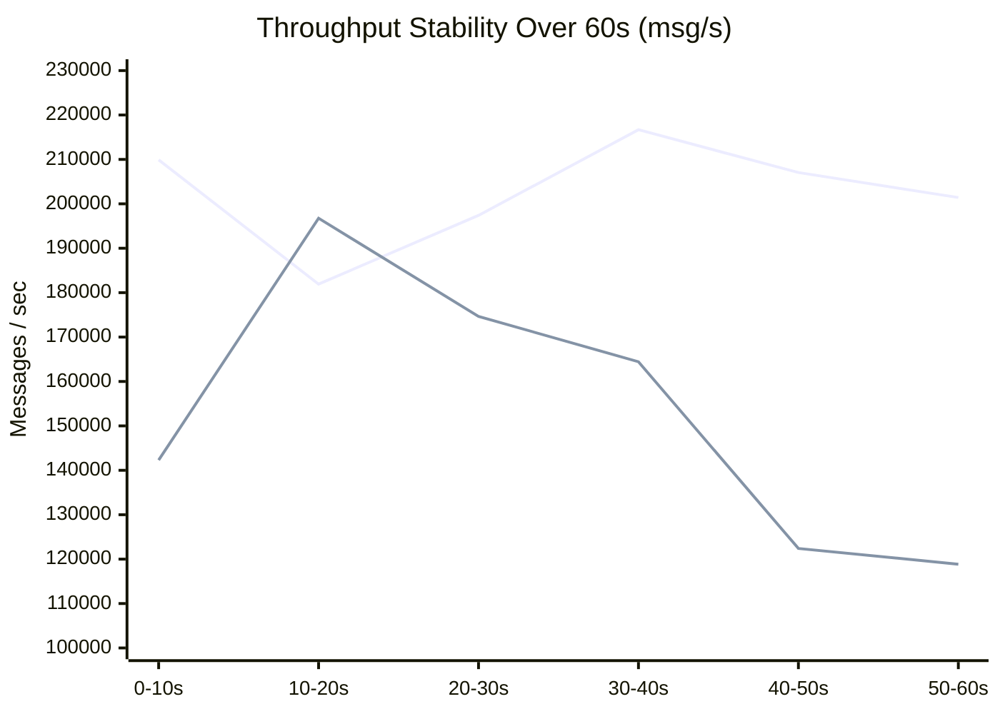

# Performance Measurement: AeroStream vs Apache Kafka

<div class="doc-badge-row" markdown>
<span class="md-tag md-tag--primary">OMB Benchmark</span>
<span class="md-tag">5 min read</span>
<span class="md-tag">Kafka Wire Protocol</span>
</div>

To evaluate real-world protocol efficiency under strict resource constraints, both AeroStream and Apache Kafka were benchmarked through the standard Kafka wire protocol using the **Linux Foundation OpenMessaging Benchmark (OMB)** framework.

Both brokers ran inside identical Docker containers limited to **2 CPUs and 2 GiB of RAM**.

---

## Results at a Glance

The benchmark workload was configured with 1 topic, 16 partitions, 1,024-byte messages, 2 producers, and 2 consumers, running at the maximum sustainable rate for 60 seconds:

| Metric | AeroStream (Port 9092) | Apache Kafka 4.3.1 | Difference |
|---|---|---|---|
| **Publish throughput (avg)** | **202,395 msg/s** (197.7 MB/s) | 153,235 msg/s (149.6 MB/s) | **+32% higher** |
| **Publish throughput (peak interval)** | **216,680 msg/s** | 196,749 msg/s | **+10% higher** |
| **Consume throughput (avg)** | **202,418 msg/s** | 153,234 msg/s | **+32% higher** |
| **Publish latency $p_{50}$** | **1.5 ms** | 30.3 ms | **20x lower** |
| **Publish latency $p_{99}$** | **452 ms** | 1,099 ms | **2.4x lower** |
| **Publish latency $p_{99.9}$** | **494 ms** | 1,289 ms | **2.6x lower** |
| **Publish latency max** | **565 ms** | 1,344 ms | **2.4x lower** |
| **End-to-end latency $p_{50}$** | **4.0 ms** | 33.0 ms | **8x lower** |
| **End-to-end latency $p_{99}$** | **485 ms** | 1,098 ms | **2.3x lower** |
| **Benchmark Errors** | **0** | **0** | Clean execution |
| **Peak broker container memory** | **533 MiB** | 1,247 MiB | **2.3x less RAM** |

---

## Throughput Over Time

OMB reports the aggregate publish rate in 10-second intervals across the run. AeroStream maintained a steady, sustained rate above 200,000 msg/s throughout the test window, while Apache Kafka's throughput deteriorated significantly in the second half of the run:

| Interval | 0–10 s | 10–20 s | 20–30 s | 30–40 s | 40–50 s | 50–60 s |
|---|---|---|---|---|---|---|
| **AeroStream (msg/s)** | 209,910 | 181,919 | 197,393 | 216,680 | 207,052 | 201,414 |
| **Apache Kafka (msg/s)** | 142,301 | 196,749 | 174,660 | 164,438 | 122,403 | 118,860 |



---

## CPU, Memory & Thermal Analysis

The container CPU allocation was capped at 2.0 CPUs (which `docker stats` reports as 200%). Metrics were gathered by continuously sampling `docker stats` throughout each run:

| Metric | AeroStream | Apache Kafka 4.3.1 |
|---|---|---|
| **Peak CPU** | 208% | 218% |
| **Average CPU (steady state)** | **134%** | 199% |
| **Median CPU (steady state)** | 142% | 207% |
| **Samples at or above 190% (near the cap)** | 32% | 84% |
| **Samples below 100%** | 42% | 0% |
| **Throughput per 1% of one CPU** | **~1,500 msg/s** | ~770 msg/s |
| **Memory footprint (start to peak)** | **41 MiB $\to$ 533 MiB** | 312 MiB $\to$ 1,247 MiB |

!!! tip "Efficiency Insight: CPU Headroom"
    **Apache Kafka was completely CPU-bound; AeroStream was not.** Kafka operated at or near the 2-CPU cap for 84% of the benchmark and never dropped below 100%. AeroStream delivered **32% more messages while consuming 33% less CPU** on average—delivering nearly **2x the work per unit of CPU**.

### Thermal Readings at Run Start

Hardware temperatures were recorded from the physical system sensors immediately prior to test initiation:

| Sensor (at run start) | AeroStream Run | Apache Kafka Run |
|---|---|---|
| **CPU Package** | 63 °C | 45 °C |
| **NVMe SSD** | 31 °C | 35 °C |

---

## Test Machine & Methodology

| Component | Specification |
|---|---|
| **Processor** | Intel Core i5-1235U (12th Gen): 2 Performance cores + 8 Efficient cores, 12 threads, 0.4 – 4.4 GHz |
| **Memory** | 15 GiB LPDDR4x |
| **Storage** | Samsung MZVLQ512HBLU NVMe SSD, 512 GB |
| **Operating System** | Debian GNU/Linux 13 (Trixie), Linux Kernel 6.12.107, Docker 29.8.1 |
| **Broker Resource Limits** | `--cpus=2.0 --memory=2g` |
| **Workload** | 1 topic, 16 partitions, 1,024-byte payloads, 2 producers, 2 consumers, producer rate 0 (OMB max-sustainable rate discovery) |
| **Client Driver** | OMB Kafka driver, `acks=1`, `linger.ms=1`, `batch.size=131072`, `max.in.flight.requests.per.connection=5` |
| **AeroStream Build** | `quay.io/gradientgeeks/aerostream:latest` |
| **Apache Kafka Build** | `apache/kafka:latest` (Kafka 4.3.1, single-node KRaft, default JVM settings) |

### Reproducing the Benchmark

To execute the identical OMB workload:

```bash
# AeroStream run (Kafka Wire Protocol Port 9092)
./omb-run.sh quay.io/gradientgeeks/aerostream:latest workloads/aerostream-16p-1kb.yaml aerostream-kafkawire

# Apache Kafka run
./omb-run.sh kafka workloads/aerostream-16p-1kb.yaml apache-kafka-kafkawire
```

---

## Caveats & Methodology Notes

!!! warning "Benchmark Considerations"
    * **Single Iteration**: Each broker was measured once under identical script orchestration. On this hybrid CPU architecture, run-to-run variation of approximately 20% can occur depending on thread scheduling to P-cores vs E-cores.
    * **Non-Dedicated Environment**: The test was executed on a bare-metal laptop with desktop background processes active, rather than an isolated bare-metal cloud server.
    * **Default Tuning**: Apache Kafka ran with standard KRaft configuration without custom garbage collection or JVM memory flags.
    * **Scope**: Only 1 KB message payloads on the Kafka wire protocol are evaluated here; native AeroStream TCP protocol throughput is substantially higher.
