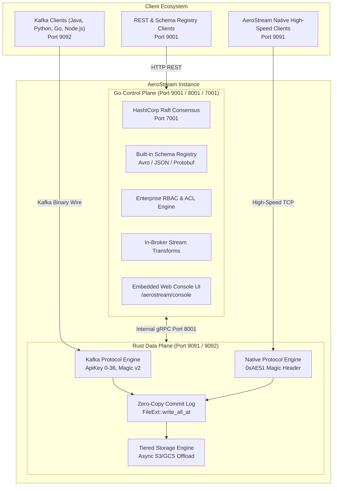

# Platform Overview & Quickstart

<div class="doc-badge-row" markdown>
<span class="md-tag md-tag--primary">Core</span>
<span class="md-tag">4 min read</span>
<span class="md-tag">Go 1.26 & Rust 1.98.1</span>
</div>

## What is AeroStream?

**AeroStream** is an open-source, ultra-high-throughput, cloud-native distributed event streaming platform engineered around a **Dual-Engine Architecture**. It combines the distributed consensus stability and operational agility of **Go Raft** with the zero-copy performance and mechanical sympathy of a **Rust Log Storage Kernel**.


!!! tip "Drop-In Apache Kafka Compatibility"
    AeroStream natively implements the Apache Kafka wire protocol on TCP port **`9092`**. Any existing application using `confluent-kafka-python`, Java/Spring Kafka, `librdkafka`, `kafkajs`, or `sarama` can point directly to AeroStream without modifying application code, rewriting schemas, or installing sidecars.

---

## Dual-Engine Architectural Rationale

AeroStream pairs two runtimes, each used where it fits best: **Go** for the control plane, where fast iteration matters (REST APIs, Raft consensus finite state machines (FSM), schema evolution rules, and access control policies), and **Rust** for the storage data plane, where predictable memory use and raw I/O matter (zero-copy `sendfile(2)`, hardware CRC32C, no garbage collector).

The control plane is cleanly decoupled from the storage data plane:

| Subsystem | Engine Runtime | Core Responsibilities | Performance Highlights |
|---|---|---|---|
| **Control Plane** | **Go 1.26** (Alpine) | HashiCorp Raft Quorum, Schema Registry, RBAC ACLs, Stream Transforms, Connectors, Web Console REST API | Green Tea GC (<1ms pause), SIMD Swiss Tables hash maps, native Kubernetes cgroup auto-tuning |
| **Data Plane** | **Rust 1.98.1** (Edition 2024) | TCP Listeners (Ports 9091/9092), Zero-Copy Segmented Commit Log, Hardware CRC32C, Tiered Storage | Zero-copy `sendfile(2)` I/O, 0.7 ms median publish latency at 100,000-200,000 msg/s, lock-free execution |



---

## Deploying a 30-Second Cluster

You can launch the complete AeroStream stack (Go Controller, Rust Zero-Copy Broker, and Embedded Web Console) with a single command using the official multi-architecture container image:

```bash
docker run -d --name aerostream \
  -p 9091:9091 -p 9092:9092 -p 9001:9001 -p 8001:8001 -p 7001:7001 \
  -v aerostream_data:/data \
  quay.io/gradientgeeks/aerostream:latest
```

### Port Mapping Reference

| Port | Protocol | Subsystem | Purpose |
|---|---|---|---|
| **`9092`** | `TCP (Kafka Wire)` | Rust Broker | **Standard Kafka Client Ingress** (`spring-kafka`, `confluent-kafka`, `librdkafka`) |
| **`9001`** | `HTTP / REST` | Go Controller | **Web Console UI**, REST Produce/Fetch, Schema Registry, Management API |
| **`9091`** | `TCP (Native)` | Rust Broker | Ultra-low latency native binary streaming protocol (`0xAE51` header) |
| **`8001`** | `gRPC` | Go Controller | Internal cluster metadata synchronization and broker registration |
| **`7001`** | `TCP (Raft)` | Go Controller | HashiCorp Raft consensus quorum transport |

### Docker Compose Quickstart

Alternatively, create a `docker-compose.yml` file for simple local orchestration:

```yaml
version: '3.8'

services:
  aerostream:
    image: quay.io/gradientgeeks/aerostream:latest
    container_name: aerostream
    ports:
      - "9091:9091"   # Ultra High-Speed Native TCP Protocol
      - "9092:9092"   # Apache Kafka Wire Protocol
      - "9001:9001"   # HTTP REST, Admin & Schema Registry
      - "8001:8001"   # Internal gRPC & Raft Quorum
      - "7001:7001"   # Web Management Console
    volumes:
      - aerostream_data:/data
    restart: unless-stopped

volumes:
  aerostream_data:
```

Launch with:

```bash
docker compose up -d
```

### Verifying Cluster Health

Inspect cluster status via the REST API:

```bash
curl -s http://localhost:9001/api/cluster | jq
```

*Expected JSON output:*

```json
{
  "node_id": "node1",
  "raft_state": "Leader",
  "raft_leader": "127.0.0.1:7001",
  "brokers_count": 1,
  "brokers": [
    {
      "id": 1,
      "host": "0.0.0.0",
      "port": 9091,
      "active": true
    }
  ],
  "topics_count": 0,
  "groups_count": 0
}
```

### Accessing the Web Console

Open your browser to:

[http://localhost:9001/aerostream/console](http://localhost:9001/aerostream/console)

The integrated Web Console allows inspecting cluster topology, topic partition states, live consumer groups, schema definitions, and broker performance metrics in real time.

---

## Connecting Clients

Point standard Kafka client libraries directly at `localhost:9092`.

=== "Python (confluent-kafka)"

    ```python
    from confluent_kafka import Producer, Consumer

    # Produce records to AeroStream
    producer = Producer({'bootstrap.servers': 'localhost:9092'})
    producer.produce('orders', key='ORD-101', value=b'{"amount": 149.50}')
    producer.flush()

    # Consume records
    consumer = Consumer({
        'bootstrap.servers': 'localhost:9092',
        'group.id': 'orders-analytics',
        'auto.offset.reset': 'earliest'
    })
    consumer.subscribe(['orders'])
    msg = consumer.poll(1.0)
    if msg:
        print(f"Received: {msg.value().decode('utf-8')}")
    consumer.close()
    ```

=== "Java / Spring Kafka"

    Add to `application.yml`:

    ```yaml
    spring:
      kafka:
        bootstrap-servers: localhost:9092
        producer:
          key-serializer: org.apache.kafka.common.serialization.StringSerializer
          value-serializer: org.apache.kafka.common.serialization.StringSerializer
          acks: 1
        consumer:
          group-id: inventory-service
          auto-offset-reset: earliest
          key-deserializer: org.apache.kafka.common.serialization.StringDeserializer
          value-deserializer: org.apache.kafka.common.serialization.StringDeserializer
    ```

=== "Kafka CLI (Bash)"

    ```bash
    # 1. Create a 3-partition topic via Controller REST API
    curl -X POST http://localhost:9001/api/topics \
      -H "Content-Type: application/json" \
      -d '{"name": "orders", "partitions": 3, "replication_factor": 1}'

    # 2. Produce records via standard Kafka CLI tools
    echo "order-101: {\"amount\": 89.50}" | kafka-console-producer.sh \
      --bootstrap-server localhost:9092 \
      --topic orders

    # 3. Consume records
    kafka-console-consumer.sh \
      --bootstrap-server localhost:9092 \
      --topic orders \
      --from-beginning
    ```

=== "Go (Segmentio kafka-go)"

    ```go
    package main

    import (
        "context"
        "fmt"
        "github.com/segmentio/kafka-go"
    )

    func main() {
        w := &kafka.Writer{
            Addr:     kafka.TCP("localhost:9092"),
            Topic:    "orders",
            Balancer: &kafka.LeastBytes{},
        }
        defer w.Close()

        err := w.WriteMessages(context.Background(),
            kafka.Message{
                Key:   []byte("ORD-101"),
                Value: []byte(`{"amount": 89.50}`),
            },
        )
        if err != nil {
            panic(err)
        }
        fmt.Println("Produced message successfully to AeroStream!")
    }
    ```
