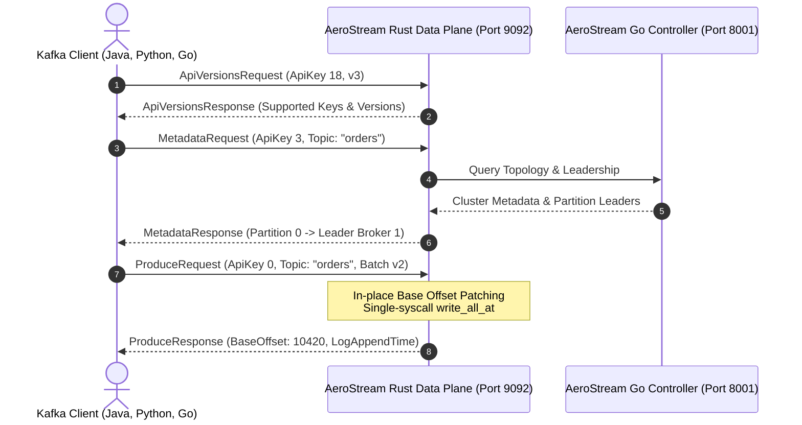

# Apache Kafka Compatibility (Port 9092)

<div class="doc-badge-row" markdown>
<span class="md-tag md-tag--primary">Drop-In</span>
<span class="md-tag">6 min read</span>
<span class="md-tag">ApiKey 0–36</span>
</div>

AeroStream provides **native, drop-in compatibility with the Apache Kafka wire protocol** over TCP port **`9092`**. It is not a proxy, sidecar, or translation gateway—the Rust data plane speaks the native Kafka binary serialization protocol directly on the wire.

Existing enterprise software developed with Kafka SDKs can switch to AeroStream simply by changing the bootstrap server endpoint.

---

## Port 9092 Kafka Wire Protocol Drop-In

When a Kafka client connects to `localhost:9092`, AeroStream negotiates protocol capabilities, manages connection framing, handles SASL authentication, and executes produce/fetch cycles adhering strictly to the official Kafka protocol specification.



---

## Supported API Keys & Versions

AeroStream currently implements full wire support for **API Keys 0 through 36**, covering core message delivery, idempotence, consumer group coordination, transactions, and access control:

| ApiKey | Name | Supported Versions | Description |
|---|---|---|---|
| **`0`** | `Produce` | v0 – v7 | Message ingestion with `acks=0`, `acks=1`, `acks=-1`/`all`, compression codecs (`None`, `Gzip`, `Snappy`, `LZ4`, `Zstd`). |
| **`1`** | `Fetch` | v0 – v11 | High watermark tracking, zero-copy `sendfile(2)` streaming, rack-aware replica selection (KIP-392), and min/max byte polling. |
| **`2`** | `ListOffsets` | v0 – v5 | Earliest (`-2`), Latest (`-1`), and timestamp-based index lookups. |
| **`3`** | `Metadata` | v0 – v5 | Cluster topology discovery, active broker addresses, topic partition layouts, leader epochs, and rack IDs. |
| **`8`** | `OffsetCommit` | v0 – v7 | Consumer group offset persistence with epoch validation and metadata payloads. |
| **`9`** | `OffsetFetch` | v0 – v5 | Consumer group partition offset queries with topic filtering. |
| **`10`** | `FindCoordinator` | v0 – v3 | Group coordinator discovery (hash-based or key-based). |
| **`11`** | `JoinGroup` | v0 – v7 | Consumer group membership management and dynamic rebalancing protocols. |
| **`12`** | `Heartbeat` | v0 – v4 | Consumer session liveness verification. |
| **`13`** | `LeaveGroup` | v0 – v4 | Clean consumer group member deregistration. |
| **`14`** | `SyncGroup` | v0 – v5 | Distribution of partition assignment plans computed by the group leader. |
| **`18`** | `ApiVersions` | v0 – v3 | Protocol negotiation, version ranges, and flexible header format resolution. |
| **`22`** | `InitProducerId` | v0 – v4 | Idempotent producer ID allocation and epoch sequencing (KIP-98). |
| **`23`** | `AddPartitionsToTxn` | v0 – v3 | Registering topic partitions within an active transaction. |
| **`24`** | `AddOffsetsToTxn` | v0 – v3 | Binding consumer group offsets to transaction boundaries. |
| **`25`** | `EndTxn` | v0 – v3 | Two-Phase Commit (`COMMIT` or `ABORT`) transaction resolution. |
| **`26`** | `WriteTxnMarkers` | v0 – v1 | Internal commit/abort markers written to partition logs. |
| **`32`** | `DescribeAcls` | v0 – v2 | Querying dynamic RBAC/ACL rules. |
| **`33`** | `CreateAcls` | v0 – v2 | Registering new principal access permissions. |
| **`34`** | `DeleteAcls` | v0 – v2 | Revoking access permissions. |
| **`36`** | `SaslHandshake` | v0 – v1 | Negotiating SASL authentication mechanisms (`PLAIN`, `SCRAM-SHA-256`). |
| **`37`** | `SaslAuthenticate` | v0 – v2 | Transporting client SASL authentication tokens. |

---

## In-Place Base-Offset Patching

In Apache Kafka's **Magic v2 RecordBatch** format, records within a batch have delta offsets relative to the batch's `base_offset`. When a producer creates a batch, it sets `base_offset = 0`. The broker must assign a globally monotonic log offset to the batch upon ingestion.

### The Naive Bridge Problem

Naive bridges and proxies decompress the entire record batch in userspace memory, iterate through each individual record, rewrite offsets, recalculate batch metadata, recompress using gzip/zstd, and re-encode. This causes:

* **Massive CPU consumption** spent in compression/decompression libraries.
* **Severe heap churn and memory allocations** (often allocating 10x the batch size).
* **High tail latency spikes** under load.

### AeroStream's Zero-Reallocation Solution

AeroStream exploits a critical property of the Kafka RecordBatch specification:

> The 32-bit CRC32C checksum in a Kafka RecordBatch covers **only bytes 21 through end-of-batch**. Bytes 0 through 8 contain the 64-bit `base_offset`, and bytes 8 through 12 contain the 32-bit `batch_length`.

Because the checksum **does not cover the base offset**, AeroStream:

1. Writes the raw network frame directly into the log segment using `FileExt::write_all_at`.
2. Overwrites the 8 bytes at segment offset 0 with the assigned monotonic `base_offset` directly on disk:

```rust
// In-place base offset patching at byte offset 0 of the record batch
let base_offset_bytes = next_offset.to_be_bytes();
segment_file.write_all_at(&base_offset_bytes, batch_start_pos)?;
```

No memory allocations. No decompression. No re-encoding. The multi-megabyte record payload is never copied!

---

## Migrating from Kafka & Redpanda

Migrating existing microservices to AeroStream requires zero code alterations. Simply point the bootstrap server configuration to AeroStream:

=== "Spring Boot (application.yml)"

    ```yaml
    # Before: Apache Kafka or Redpanda
    # spring.kafka.bootstrap-servers: kafka-cluster.internal:9092

    # After: AeroStream (Drop-in replacement)
    spring:
      kafka:
        bootstrap-servers: aerostream.internal:9092
        producer:
          acks: all
          retries: 3
    ```

=== "Python (librdkafka / confluent-kafka)"

    ```python
    # Before:
    # conf = {'bootstrap.servers': 'kafka-prod.corp:9092'}

    # After:
    conf = {
        'bootstrap.servers': 'aerostream.corp:9092',
        'group.id': 'payment-processors',
        'auto.offset.reset': 'earliest'
    }
    ```

=== "kcat / kafkacat CLI"

    Verify metadata and consume immediately using standard debugging tools:

    ```bash
    # Query cluster metadata
    kcat -b localhost:9092 -L

    # Produce a test message
    echo "hello aerostream" | kcat -b localhost:9092 -t test-topic -P

    # Consume from beginning
    kcat -b localhost:9092 -t test-topic -C -o beginning
    ```
