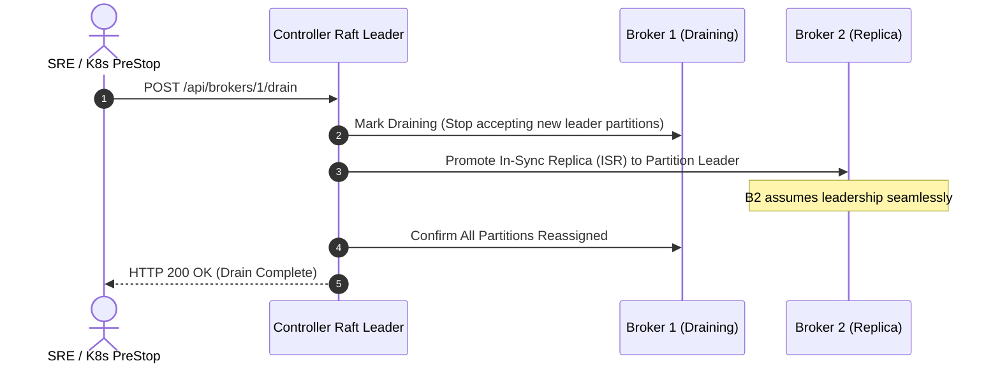

# Production Operations & Kubernetes

<div class="doc-badge-row" markdown>
<span class="md-tag md-tag--primary">Operations</span>
<span class="md-tag">8 min read</span>
<span class="md-tag">Kubernetes & Sizing</span>
</div>

Operating AeroStream in production is straightforward due to its lean memory footprint, lack of JVM Garbage Collection tuning, and native container cgroup awareness.

This guide outlines hardware sizing, Kubernetes StatefulSet deployment patterns, graceful scale-down draining, and Prometheus observability.

---

## Production Hardware Sizing

Thanks to Rust's zero-copy architecture and Go's Green Tea GC, AeroStream achieves high compute density:

| Scale Tier | Throughput Target | Recommended CPU | Recommended RAM | Storage Configuration |
|---|---|---|---|---|
| **Edge / Dev** | Up to 50 MB/s | 1 vCPU | 512 MiB | Standard SATA / Cloud SSD |
| **Standard Production** | Up to 500 MB/s | 2 – 4 vCPUs | 2 – 4 GiB | Single NVMe SSD + S3 Tiered Storage |
| **Extreme Scale** | 1,000+ MB/s | 8 vCPUs (Pinned) | 8 – 16 GiB | Dual NVMe RAID-0 + S3 Tiered Storage |

---

## Kubernetes StatefulSets & PreStop

In Kubernetes, AeroStream is deployed as a **StatefulSet** backed by persistent volume claims (PVCs) for local NVMe storage:

```yaml
apiVersion: apps/v1
kind: StatefulSet
metadata:
  name: aerostream-broker
  namespace: aerostream
spec:
  serviceName: aerostream-headless
  replicas: 3
  selector:
    matchLabels:
      app: aerostream-broker
  template:
    metadata:
      labels:
        app: aerostream-broker
    spec:
      containers:
        - name: broker
          image: quay.io/gradientgeeks/aerostream:latest
          ports:
            - containerPort: 9091
              name: native-tcp
            - containerPort: 9092
              name: kafka-wire
            - containerPort: 9001
              name: http-rest
            - containerPort: 8001
              name: grpc
            - containerPort: 7001
              name: raft
          resources:
            requests:
              cpu: "2"
              memory: "2Gi"
            limits:
              cpu: "4"
              memory: "4Gi"
          lifecycle:
            preStop:
              exec:
                command:
                  - "/bin/sh"
                  - "-c"
                  - "curl -s -X POST http://127.0.0.1:9001/api/brokers/${HOSTNAME##*-}/drain && sleep 10"
          volumeMounts:
            - name: data
              mountPath: /data
  volumeClaimTemplates:
    - metadata:
        name: data
      spec:
        accessModes: ["ReadWriteOnce"]
        storageClassName: nvme-storage
        resources:
          requests:
            storage: 200Gi
```

---

## Graceful Broker Partition Draining

When scaling down a cluster or taking a node offline for kernel upgrades, simply killing the broker process triggers emergency leader elections and transient consumer disconnections.


AeroStream provides **Automated Partition Draining**:



Trigger draining manually via the REST API:

```bash
# Gracefully drain broker ID 1
curl -X POST http://localhost:9001/api/brokers/1/drain
```

---

## Prometheus Observability & Health Checks

AeroStream exposes standard Prometheus metrics at `http://localhost:9001/metrics`.

### Key Performance Indicators (KPIs)

* `aerostream_produce_messages_total`: Cumulative count of ingested messages by topic and partition.
* `aerostream_produce_bytes_total`: Total ingress volume in bytes.
* `aerostream_fetch_bytes_total`: Total egress volume served via `sendfile(2)`.
* `aerostream_active_connections`: Current active TCP client connections.
* `aerostream_raft_leader_status`: 1 if the current node is the elected Raft leader, 0 otherwise.
* `aerostream_segment_roll_duration_seconds`: Time taken to seal and roll segment files.

### Health Check Probes

Configure Kubernetes probes to verify node health:

```yaml
livenessProbe:
  httpGet:
    path: /status
    port: 9001
  initialDelaySeconds: 5
  periodSeconds: 10

readinessProbe:
  httpGet:
    path: /readyz
    port: 9001
  initialDelaySeconds: 3
  periodSeconds: 5
```
