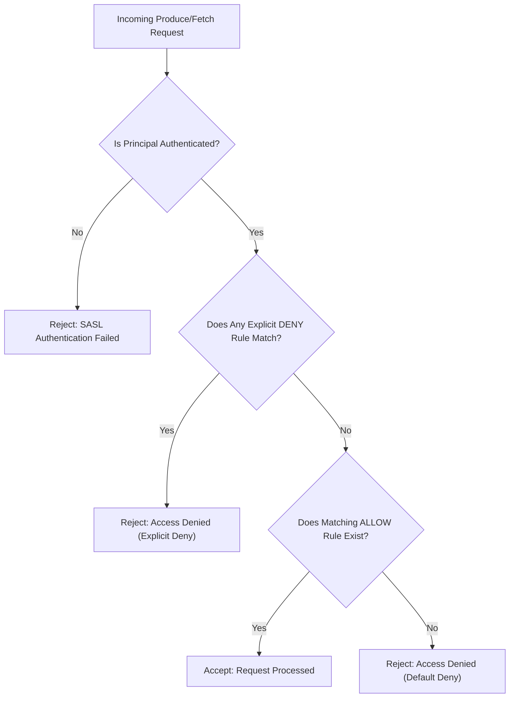
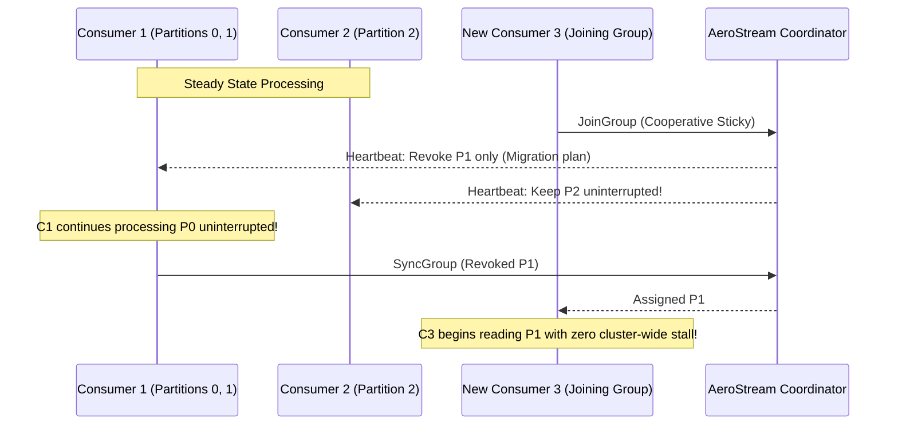

# Enterprise Security, RBAC & ACLs

<div class="doc-badge-row" markdown>
<span class="md-tag md-tag--primary">RBAC & ACLs</span>
<span class="md-tag">6 min read</span>
<span class="md-tag">KIP-848 Rebalance</span>
</div>

AeroStream provides **enterprise-grade zero-trust security**, combining role-based access control (RBAC), granular Kafka-compatible Access Control Lists (ACLs), SASL authentication, and advanced consumer group rebalancing protocols.

---

## Principal Roles & Permissions

Principals (human operators and machine service accounts) can authenticate via **SASL/PLAIN**, **SASL/SCRAM-SHA-256**, or **mTLS** client certificates.

AeroStream organizes cluster authority around five enterprise roles:

| Role | Permitted Actions | Intended Usage |
|---|---|---|
| **`SUPER_ADMIN`** | Unrestricted cluster administration, node draining, Raft configuration, ACL editing, schema deletion. | Infrastructure SREs and automation orchestrators. |
| **`OPERATOR`** | Topic creation/deletion, partition expansion, connector lifecycle management, transform creation. | Platform engineers and CI/CD deployment pipelines. |
| **`PRODUCER`** | Produce records (`Write`), initialize idempotent/transactional IDs, query topic metadata. | Ingestion services, microservice event publishers. |
| **`CONSUMER`** | Fetch records (`Read`), commit consumer group offsets, query metadata. | Real-time analytics, downstream databases, stream sinks. |
| **`AUDITOR`** | Read-only inspection of cluster topology, active schemas, metrics, and security audit logs. | Compliance auditors, monitoring agents, security inspectors. |

---

## Granular ACL Rules & Wildcards

For fine-grained multi-tenant governance, AeroStream evaluates **Kafka-compatible ACL rules** using Go 1.26 SIMD Swiss Tables for sub-microsecond authorization decisions.



### Resource Types & Pattern Matching

* **Resource Types**: `TOPIC`, `GROUP`, `CLUSTER`, `TRANSACTIONAL_ID`.
* **Pattern Types**:
    * `LITERAL`: Matches exact string (e.g. `orders-payments`).
    * `PREFIXED`: Matches any resource starting with prefix (e.g. `orders-*` matches `orders-us`, `orders-eu`).
    * `WILDCARD`: Matches all resources of the given type (`*`).

### Managing ACLs via REST API

Create an ACL rule granting a payment service write access to all `orders-*` topics:

```bash
curl -X POST http://localhost:9001/api/security/acls \
  -H "Content-Type: application/json" \
  -d '{
    "principal": "User:service-payment",
    "resource_type": "TOPIC",
    "resource_name": "orders-",
    "pattern_type": "PREFIXED",
    "operation": "WRITE",
    "permission_type": "ALLOW"
  }'
```

List active ACL policies:

```bash
curl -s http://localhost:9001/api/security/acls | jq
```

---

## Cooperative Sticky Rebalance (KIP-848)

In traditional streaming engines, partition reassignment follows the **Eager Rebalance Protocol**. When a single consumer pod restarts:

1. **Stop-the-World Phase**: All consumers in the group immediately revoke *all* their assigned partitions.
2. Ingestion pauses completely across all microservice instances.
3. Once the group syncs, consumers re-fetch metadata and resume, causing massive latency and lag spikes.

### The AeroStream Cooperative Approach

AeroStream implements **Cooperative Sticky Rebalancing** (matching the modern KIP-848 specification):



1. **Non-Revoking Assignment**: Consumers not involved in migrating partitions continue streaming without pausing.
2. **Minimal Partition Migration**: Only the exact partition shifting ownership is revoked and transferred.
3. **Zero Lag Spikes**: Rolling Kubernetes deployments no longer trigger consumer lag storms or buffer overflows.
